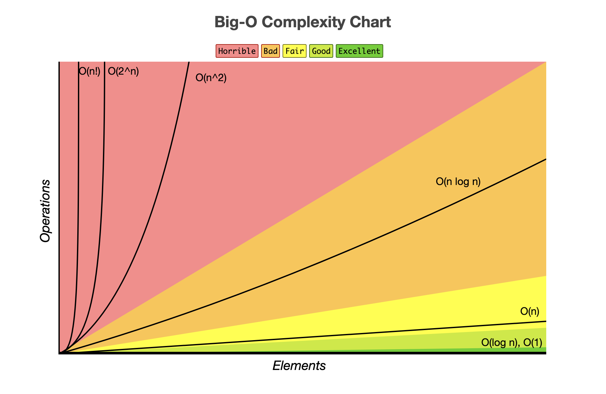

= Algorithms

== Big O
Is worst case scenario, measures how algorithm grows with size of operations.

|===
| O | Example | Note

| O(1) | Access hashmap | Constant time
| O(log n) | Binary Search | Divide and Conquer
| O(n) | Simple search | Grows linearly
| O(n * log n) | Quick sort | 
| O(n^2) | Selection sort |
| O(n!) | Traveling sales man | Grows rapidly
|===

=== Example

1,000,000 records - 1 ms per compare record
|===
| Big-O | Elapsed

| O(1) | 1 ms
| O(log n) | 6 ms
| O(n) | 16 mins
| O(n^2) | 31 years
| O(2^n) | 🔥 
| O(n!) | 🔥
|=== 

[glossary]
== Glossary
Logarithms:: wet, cold dirt
Factorial:: wet, cold dirt

== Resources
