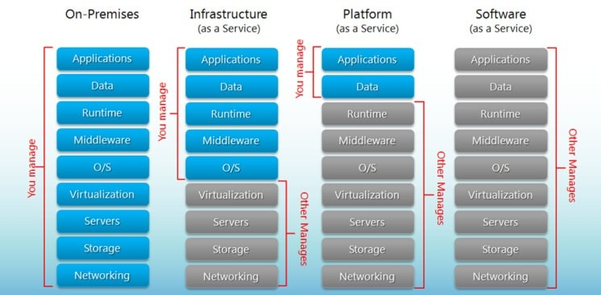

= Models

* On-Premises (Hardware + OS + App)
* Infrastructure (OS + App)
* **Platform (App)** (Azure App Service, AWS Beanstalk) 
** Handles
*** Servers
*** Databases
*** Deployment
*** Scaling
***  Load balancing
* Software (Nothing)
** Azure DevOps 
** Sharepoint

