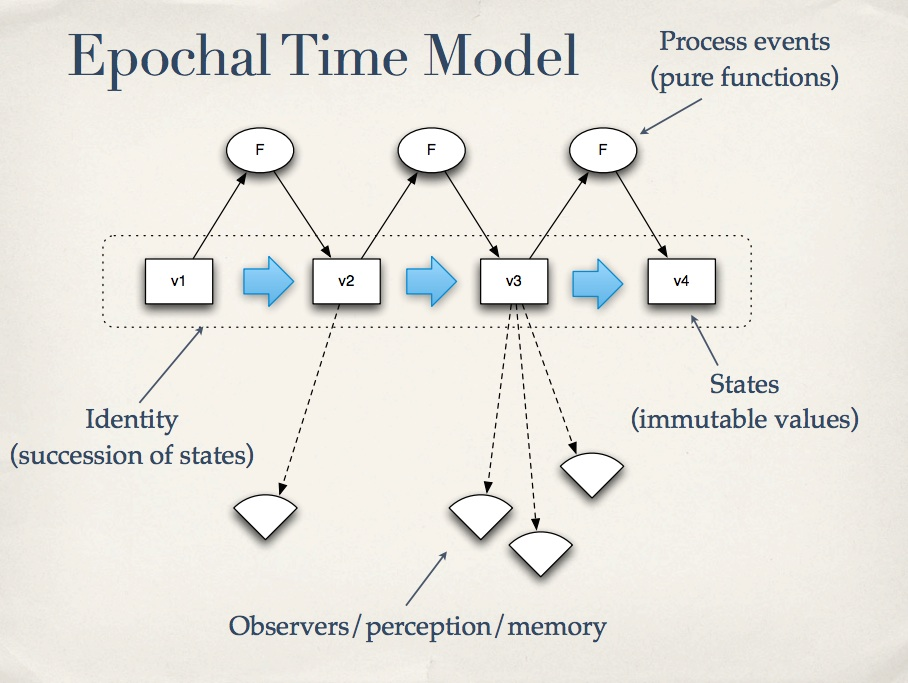

= Concurrency 

== OOP Concurrency
Objects have no concurrency coordination leading to nondeterministic results. Multiple threads reading and writing the the same location (PLOP).

=== Race conditions
As two threads can read and write to the same location the value depends on the order of the reads and writes.

WARNING: One increment could be lost. If both Threads run simultaneously, both will read Count of 0 and update to 1 so one increment will be missed. 

[source, csharp]
----
private class Counter
{
    public int Count { get; set; }
}

static void Main(string[] args)
{
    var myCount = new Counter();

    var a = new Thread(() => { myCount.Count += 1; });
    var b = new Thread(() => { myCount.Count += 1; });
	
	a.Start();
	b.Start();
	a.Join();
	b.Join();

    Console.WriteLine(myCount.Count); => ?? 1 or 2
}
----

=== Mutual Exclusion (Mutex)
Make your program single threaded.

=== Deadlocks 
Make your program single threaded.

== Clojure Concurrency
Clojure adds concurrency models to handle updating state.

* atom
** reference type like the epochal time model below 
* refs
** transactions - all or thing
* core.async 

  