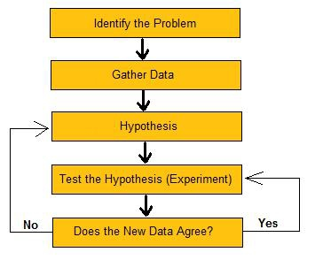

= General

link:http://www.prweb.com/releases/2013/1/prweb10298185.htm["on average, software developers spend 50% of their programming time finding and fixing bugs."]

== Why

=== Observe and Understand

. Adding instrumentation 
* Is like adding gauges and meters to a mechanical system.
** In code (print) - easy to add - can cause errors if left in 
** Runtime - More power output - more complex 

=== Exploration
When exploring new projects, debugging is often how you start learning about how the code works and how it's structured. When you need to alter code structure (e.g. breaking apart a large function before changing its behavior) you need to understand how it works. Learning how libraries work can be difficult. Often the documentation is insufficient and it’s necessary to dive in to the code to answer questions.

=== Fixing Bugs
It's unavoidable, it will be necessary to solve issues that present themselves in production. People will always write bugs, therefore you will always have to debug code.

== Resources 

* link:https://aphyr.com/posts/319-clojure-from-the-ground-up-debugging[Clojure from the group up]
* link:https://cambium.consulting/articles/2018/2/8/the-power-of-clojure-debugging[The power of Clojure debugging]
* link:https://vimeo.com/237220354[Scope capture Demo]
* link:https://www.youtube.com/watch?v=FihU5JxmnBg[Debugging with the Scientific Method]
* link:http://blog.cognitect.com/blog/2017/6/5/repl-debugging-no-stacktrace-required[REPL Debugging: No Stacktrace required]