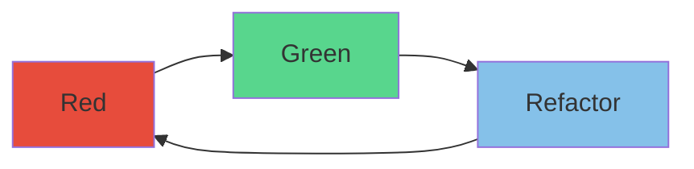

# Test Driven Development (TDD)

Tests continually add constraints to code making the code fit the specification, but tests can only prove wrong not that the program is right.

## Why

* So you can refactor and clean up your mess 
* Prevent regressions so you don't break anything else 
* It's a good idea to understand what you are doing before you start 
	* Writing your expectations first does that 
* Easily test edge cases 
	* What if the user inputs 
		* nothing?
		* SQL?
		* a million characters?
* Tests act as documentation

## Benefits

* Peak - Andres Ericsson
	* Specific goal
	* Fast feedback
	* Pomodoro sized for focus
* Acts a regression testing so you can refactor
* Ensures certain edge case (common business cases) are covered
* Acts as documentation

## Cons

* Crashing into barriers to end up where you need to go, no thought in how you go there. (Transformation Priority Premise is just a PREMISE)
* Can't prove program is correct
	* 100% Test coverage doesn't mean program is correct
* Not as thorough as Property based test
  * Diamond kata
  * Highlight bugs/edge cases you didn't think of

## Properties

* Fast (ms)
	* or you won't run them
* Isolated (No shared state)
	* Tests can be run in parallel (Fast) 
* Readable
	* Use `Is` instead of `Should be`
	* [Bad] Given Delivery has a past date When try to deliver Then delivery should be invalid
	* [Good] Delivery with past date is invalid

## Order of tests

1. Degenerate cases
	* nil, empty, 0, default, etc..

2. Simple cases
	* One element (Sort kata)
	* A row (Diamond kata)
	* All 0 (Bowling kata)
	* (wrap 1 "a") (word wrap)

3. Specific cases
	* Strike (Bowling kata)
	* Handle new line (wrap 1 "aa") (word wrap)
	* Word is mid line break (wrap 3 "a bb" (word wrap)

## How to write tests

* Red 
	* Assert first
		* Ensures test is checking your hypothesis  
	* Avoids false positive test results
* Green 
	* MVP to pass test
* Refactor

Three laws of TDD::
* Write production code only to pass a failing unit test.
* Write no more of a unit test than sufficient to fail (compilation failures are failures).
* Write no more production code than necessary to pass the one failing unit test.

## Extra tips on writing code/tests

* Transformation Priority Premise
	* Apply transformations to production code
* Fake it til you make (Triangulation)
	* "As the tests get more specific the code gets more generic"
* One-To-Many
	* If collection, handle single element first then handle collection

## How to handle Collaborators

* Classical (Blackbox testing) (Preferred)
  * Stub shared collaborators (External state such as Database, File System)
* London (Whitebox testing)
  * Stub all queries except values 
  * Spy all commands

## Examples

### Word wrap
. Degenerate cases
   * Bad input returns empty string
     ** `(wrap 1 nil) #> ""`
     ** `(wrap 1 "") #> ""`
   * Space at start of string returns string without space
     ** `(wrap 1 " a") #> "a"`
. Simple -> Complex cases
   * Input length is less than width so return input
     ** `(wrap 1 "a") #> "a"`
   * Line split puts each string on to a new line
     ** `(wrap 1 "a\nb") #> "a\nb"`
   * Line split mid word keeps word intact
     ** `(wrap 3 "a bb") #> "a\nbb"`

### Invert name
. Degenerate cases
   * Bad input returns empty string
     ** `(invert nil) => ""`
     ** `(invert "") => ""`
. Simple -> Complex cases
   * Invert first and last name
     ** `(invert "First Last") => "Last, First"`
   * Ignore honorific
     ** `(invert "Mr. First Last") => "Last, First"`
   * Keep post nominal
     ** `(invert "First Last Phd.") => "Last, First Phd."`
