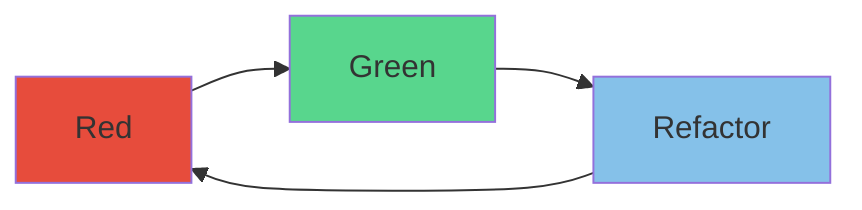

# Test Driven Development (TDD)

TDD incrementally add constraints (tests) as you develop,
so that your code meets incrementally meets each specification.

* Handle nil/error boundary
* Handle simple cases
* Handle more complex scenarios

## Pros

* Sets a goal (test) before you even start - What are you even trying to do?
* Enables refactoring - clean up your implementation
* Prevent regressions - ensure your implementation doesn't break anything else
* Fast feedback - tests execute under 1ms and --watch mode give you instant feedback
* Ensures edge case are covered
  * What if the user inputs?
    * ""
    * SQL
    * a million characters
* Acts as documentation

## Cons

* Crashing into barriers to end up where you need to go,
no thought in how you go there
* Can't prove program is correct
  * 100% Test coverage doesn't mean program is correct
* Not as thorough as Property based test
  * Diamond kata
  * Highlight bugs/edge cases you didn't think of

## Properties

* Fast (under ~1ms)
  * Otherwise you won't run them
* Isolated (No shared state)
  * Avoids flakey tests caused by race conditions caused by other tests
  * Tests can run in parallel leading to quicker test suites
* Readable
  * Use `Is` instead of `Should be`
  * [Bad] Given Delivery has a past date When try to deliver Then delivery should be invalid
  * [Good] Delivery with past date is invalid

## Order of tests

1. Degenerate cases

* nil, empty, 0, default, etc.

2. Simple cases

* One element (Sort kata)
* A row (Diamond kata)
* All 0 (Bowling kata)
* (wrap 1 "a") (word wrap)

3. Specific cases

* Strike (Bowling kata)
* Handle new line (wrap 1 "aa") (word wrap)
* Word is mid line break (wrap 3 "a bb") (word wrap)

## How to write tests

* Red.
  * Assert first - Ensure your test is checking your hypothesis  
  * Avoids false positive test results
* Green.
  * MVP to pass test
* Refactor.
  * Clean up code

## Three laws of TDD

* Write production code only to pass a failing unit test
* Write no more of a unit test than sufficient to fail (compilation failures are failures)
* Write no more production code than necessary to pass the one failing unit test

## Extra tips on writing code/tests

* Transformation Priority Premise
  * Apply transformations to production code
* Fake it til you make (Triangulation)
  * "As the tests get more specific the code gets more generic"
* One-To-Many
  * If working with a collection, handle a single element first then handle the collection

## How to handle Collaborators

* Classical (Blackbox testing) (Preferred)
  * Stub shared collaborators (External state such as Database, File System)
* London (Whitebox testing)
  * Stub all queries except values
  * Spy all commands

## Examples

### Word wrap

* Invalid input returns an empty string
  * `(wrap 1 nil) #> ""`
  * `(wrap 1 "") #> ""`
* Space at start of string returns string without space
  * `(wrap 1 " a") #> "a"`
* Input length is less than the width so return input
  * `(wrap 1 "a") #> "a"`
* Line split puts each string on to a new line
  * `(wrap 1 "a\nb") #> "a\nb"`
* Line split mid word keeps word intact
  * `(wrap 3 "a bb") #> "a\nbb"`

### Invert name

* Invalid input returns an empty string
  * `(invert nil) => ""`
  * `(invert "") => ""`
* Invert first and last name
  * `(invert "First Last") => "Last, First"`
* Ignore honorific
  * `(invert "Mr. First Last") => "Last, First"`
* Keep post nominal
  * `(invert "First Last Phd.") => "Last, First Phd."`
