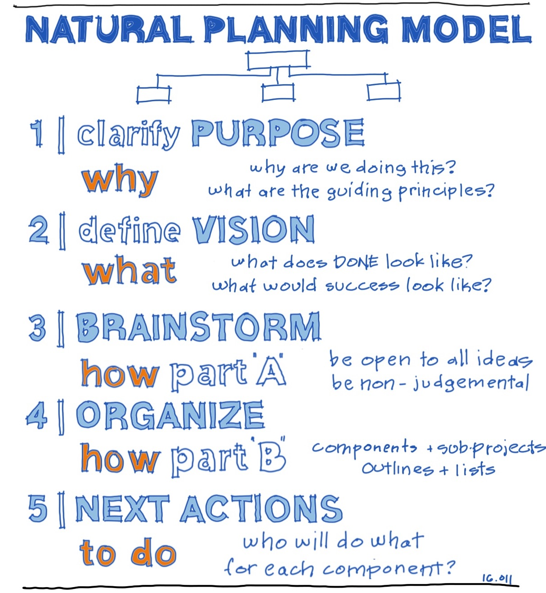

= Overview

. Management
.. Handle novelty
.. Plan
... Priorties (80/20)
. Execute
.. Focus (Pomodoro)
.. TDD
... Understand problem - Set a goal/test
.. Challenge self
... Feynman technique - explain undestanding simply
... Create something (Project)
... Practise test

== Management
image::resources/gtd_workflow.png[Manage]

== Execute
image::resources/pomodoro.png[Focus]
image::resources/tdd.png[Process]
image::resources/feynman-technique.jpg[Understand]
