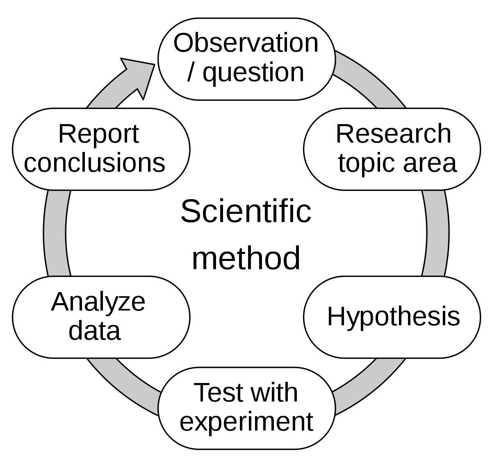

# Debugging

"It is a capital mistake to theorise before you have all the evidence. It biases the judgment"
-- Study of Scarlet
    

## State the problem

"If you don't know where you are going, any road will get you there"
-- Lewis Carroll
    

- List facts and constraints
- Tease apart problem, removing assumptions, analysis, and common sense
- Ask stupid questions until you start getting more reasonable

## Write down each cycle

Otherwise you're remembering every previous test and result. (Hubris)

## Steps

* Observe / Question
** Steps taken
** Expected vs Actual
** Pair programming (Rubber duck)
** Question why it failed
* Research topic / Find related problems
** Read the manual
** Google
* Hypothesis (Causes)
** Cause mapping
** Causal tree analysis
* Experiment
** What experiment should show
** Why experiment even makes sense
** Should be
*** Reproducible
*** Driven by hypothesis
*** Small
** Change one variable at a time
* Analyse
** REPL
** Loggers
** Debuggers
** Stacktrace
** Print statements
* Report

## References

* https://www.youtube.com/watch?v=FihU5JxmnBg[Debugging with the Scientific Method - Stuart Halloway]
* https://www.youtube.com/watch?v=OUZZKtypink[Sherlock Holmes, Consulting Developer - Stuart Halloway]