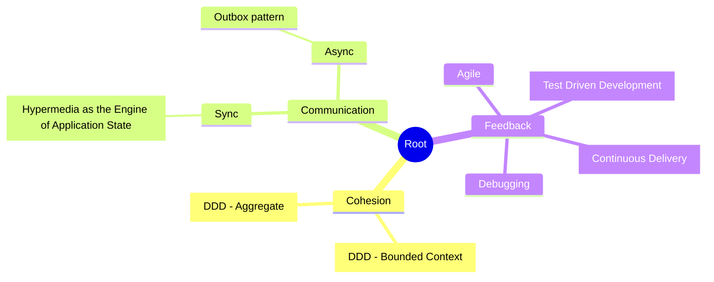

# Kyle Grierson

```mermaid
mindmap
root((Root))
  Cohesion
    Bounded Context [DDD - Bounded Context]
    Aggregate [DDD - Aggregate]
  Communication
    Sync
      HATEOAS [Hypermedia as the Engine of Application State]
    Async
      Outbox pattern
  Feedback
    TDD [Test Driven Development]
    Agile
    CI/CD [Continuous Delivery]
    Debugging
```
