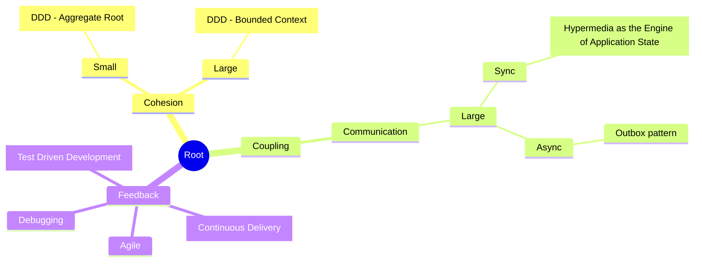

# Kyle Grierson

```mermaid
mindmap
root((Root))
  Cohesion
    Small
      Aggregate Root [DDD - Aggregate Root]
    Large 
      Bounded Context [DDD - Bounded Context]
  Coupling
    Communication
      Large
        Sync
          HATEOAS [Hypermedia as the Engine of Application State]
        Async
          Outbox pattern
  Feedback
    TDD [Test Driven Development]
    Agile
    CI/CD [Continuous Delivery]
    Debugging
```
