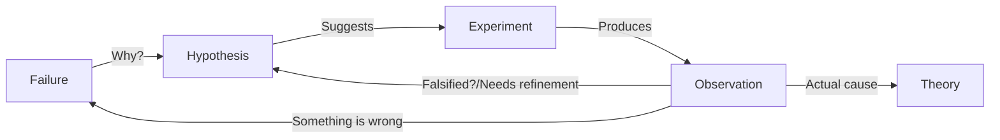
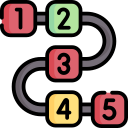
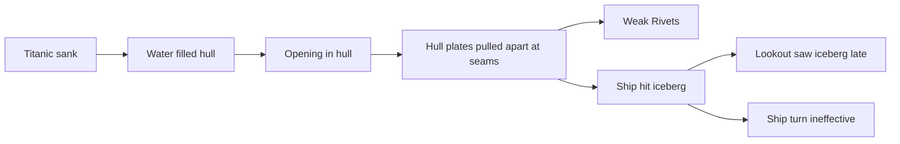

# Debugging

Having the right mindset

* There is always a logical explanation
* Being stuck is only tempory
* Timebox
* Priortise
  * An unlikey bug with little consequence doesn't need to be fixed right away




## Failure

Something isn't working as expected.

### :fire: !!! __STATE THE PROBLEM__ !!! :fire: #1

> If you don't know where you are going, you might wind up someplace else


1. Steps you/they took
2. What you/they expected
3. What actually happend

* Write down your understanding and improve as you go along
  * Does you explanation cover every point
* Iterative process
  * Progressively ask less stupid questions
* Feynman technique
  * Explaining the problem to a rubber duck helps finds the gaps in your understanding
* Deductive reasoning (Suduku)
  * What do we know? (Constraints, Facts)
  * What do we need to know?
    * What is `x`?
    * Does `y` work how I expect?
* Talk to Pair

### Sequence of events



* :fire: Write down the sequence of events that lead to bug
* Analyse the evidence
  * Get screen recording/screenshot
  * Analyse the logs
  * Check the database/event feed/queue
* Draw it
  * Flowchart
  * Network
  * State
  * Sequence (Backed with logs)
  * Graphviz
* Read the stacktrace __carefully!!!__
* Check recent commits (Git bisect:fire:)

### Reproduce the bug

* Reproducing the bug means you can control each variable while you experiment
* Create a smaller program with the same bug so you have less variables
and a quicker feedback loop

#### Skepticism

* "There were no footmarks" - Man
* "Meaing that you saw none?" - Sherlock

"Error occurs on Cassandra but not H2"

Write a test that performs the problem query against both databases so
have no other dependencies.

The problem was actually a miscommunication problem,
reproducing the issue showed the problem occured on both databases

#### Print statements


Just like gauges in mechanical systems, add instrumentation to
your system so you can see whats happening

```clojure
(defn n 24)

(defn foo
      [n]
      (cond #p (> n 40) #p (+ n 20)
            #p (> n 20) #p (- (first n) 20)
            :else #p 0))

(foo n)

;; (> n 40) -> false
;; (+ n 20) -> 44
;; (> n 20) -> true
;; (- (first n) 20) -> Exception
;; 0 -> 0
```

Or better yet just eval each expression in the REPL

### Research


* RTFM
* Google
* Retrace from the line that failed and work backwards on what may have led
to the cause
* Compare with a working example from the project docs

#### Example

```clojure
(def partial-join (partial (clojure.string/join ",")))

(partial-join ["foo" "bar"])
; => Exception!
```

String join docs

```text
(join coll) (join separator coll)

Returns a string of all elements in coll, as returned by (seq coll),
 separated by an optional separator.
```

## Hypothesis (Cause)

A proposed explanation made on the basis of __limited eviedence__ as
a __starting point__ for further investigation

Cause mapping (N whys). More than one reason why something happened.



An event preceding an effect without which the effect would not have occurred


* :fire: Write down your hypothesises
* Include silly ideas
* Priortise
* Hammock time
* Only move foward when you have enough data

### Example

```clojure
(def partial-join (partial (clojure.string/join ",")))

(partial-join ["foo" "bar"])
; => Exception!
```

* `string/join` doesn't do what I want
* `partial` doesn't do what I want
* `def` doesn't do what I want

## Experiment

1. Reproducible
2. Driven by hypothesis
3. Small
4. Change only one thing


* :fire: __Write down your experiments__ :fire:
  * What variable did you test?
  * What did you expect? What was the actual result?
  * Why the experiment makes sense?
* Short feedback loop
  * Unit test
  * Try good and bad inputs to demonstrate defect

## Observation

1. Understand all the outputs
   1. Don't know the output? How do you know if it's related to the problem or not
2. Suspect correlations
   1. Bug in the last 5 lines
3. Use good tools (More outputs)
   1. Debuggers, Logging, Print, Metrics


* IF experiment supports hypothesis
* THEN refine hypothesis or diagnose
* ELSE reject hypothesis

## Theory (Diagnosis)


*
* A hypothesis offering valid predictions that can be observed
* Blog/tell a friend what you learned
* Does theory cover all of you problems
* Take a break

## Resources

* [Sherlock Holmes, Consulting Developer - Stuart Halloway](https://www.youtube.com/watch?v=OUZZKtypink&ab_channel=ClojureTV)
* [Debugging with the Scienific Method](https://www.youtube.com/watch?v=FihU5JxmnBg&ab_channel=ClojureTV)
* [Hammock Driven Development](https://www.youtube.com/watch?v=f84n5oFoZBc&ab_channel=ClojureTV)
* [Running with Scissors](https://www.youtube.com/watch?v=Qx0-pViyIDU&ab_channel=StrangeLoopConference)
* [REPL DEBUGGING: NO STACKTRACE REQUIRED](http://blog.cognitect.com/blog/2017/6/5/repl-debugging-no-stacktrace-required)
* [Clojure from the ground up: debugging](https://aphyr.com/posts/319-clojure-from-the-ground-up-debugging)

### Tools

* Debugger
* Profilers - perf
* Tracers - strace
* Network spy - ngrep
