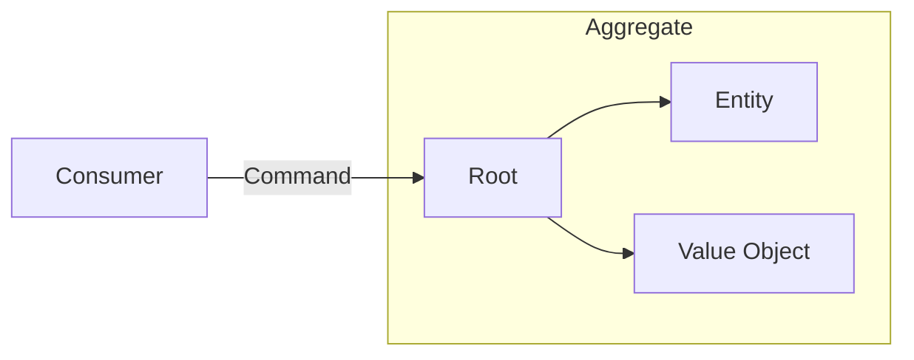

# Domain Driven Design

Patterns to help model a solution to a problem.

Identify current business processes and design solutions that follow those
same processes and using the same terminology,
not adding your own implementations and terms.

## Glossary

* Problem Domain - The problem
* Solution Domain - Implementation of the problem
* Subdomains
  * Core Domain - Companies main product
  * Supporting - Required to operate but not directly linked to core product
  * Generic - Off the shelve products (Email, Auth, CMS)
* Domain model/layer - Model of the business concepts and rules.
* Bounded Context - Cohesion, Group things that change together and share language
* Ubiquitous language - Language used by Business and Developers
* Context Mapping - How Bounded Contexts interact with each other
* Shared Kernel - Used across Bounded contexts (Auth, REST)
* Service - Coordinate interaction between aggregates (Stateless)
* Aggregate - Consistency boundary for grouped Entities and Value Objects
* Entity - Unique Identifier with Data and Behaviour
* Value Object - Not unique, Additional constraints over primitives, Immutable
  * Email address - A string could be anything, but Emails have specific constraints
    * "foo" is a valid string but not a valid email
    * "<foo@email.com>" is a valid string and a valid email

## Language matters

`FooFactory` programming lingo

## Aggregate Root

What? Grouping of associated objects

Why

* Consistency boundary
  * All commands are managed by the `Aggregate Root` acts as the API for the aggregate
* Ensures `invariants`
  * Ensures `invariants` are maintained across all `Objects` within the `Aggregate`

Rules

* Maintains `Invariants` across `Objects`
* Cohesive
* Only referrers to other `Aggregates` by `ID`
* Updates to other `Aggregates` is `Eventual Consistency`

## Bounded Context

## Context Mapping
