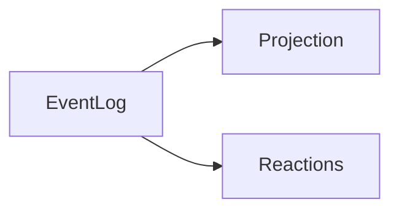

# Event sourcing

Looking at a mutable database only shows you the current snapshot of your
application state.
You can't answer questions like `How did we get here?` or
`What was the previous state?` because no state tranistions are recorded.

`Event sourcing` instead stores each `event` then you view a `projection` to
get your current application state.

For example in Chess you store each move using `Chess notation` so that you or
anyone else can replay the game and review each move. The chess board is the
current state but `Chess notation` is each `event` which lead to the current
state

<div>

<code>
1. Nf3 Nf6 2. c4 g6 3. Nc3 Bg7 4. d4 O-O 5. Bf4 d5 6. Qb3 dxc4 7. Qxc4 c6 8. e4 Nbd7 9. Rd1 Nb6 10. Qc5 Bg4 11. Bg5 Na4 12. Qa3 Nxc3 13. bxc3 Nxe4 14. Bxe7 Qb6 15. Bc4 Nxc3 16. Bc5 Rfe8+ 17. Kf1 Be6 18. Bxb6 Bxc4+ 19. Kg1 Ne2+ 20. Kf1 Nxd4+ 21. Kg1 Ne2+ 22. Kf1 Nc3+ 23. Kg1 axb6 24. Qb4 Ra4 25. Qxb6 Nxd1 26. h3 Rxa2 27. Kh2 Nxf2 28. Re1 Rxe1 29. Qd8+ Bf8 30. Nxe1 Bd5 31. Nf3 Ne4 32. Qb8 b5 33. h4 h5 34. Ne5 Kg7 35. Kg1 Bc5+ 36. Kf1 Ng3+ 37. Ke1 Bb4+ 38. Kd1 Bb3+ 39. Kc1 Ne2+ 40. Kb1 Nc3+ 41. Kc1 Rc2# 0-1
</code>
</div>

"Why do I only have 20p in my bank account?" With an event log you can see
each transaction and where the money has gone. Without an event log you can
only see your current balance so you cant workout where to cutback.

## How

Each event has an `Type` e.g `[Withdraw, Deposit, Transfer]` then you can have
`Projections` which read from the log and create a current state eg `balance`.
`Reactions` could look for `Withdraw` events and send notifications about the
withdrawal



Event Log

```json
[
 {
  "type": "Deposit",
  "time": "2023-03-15 20:57",
  "account": 123,
  "amount": "$10"
 },
 {
  "type": "Withdraw",
  "time": "2023-03-19 22:12",
  "account": 123,
  "amount": "$5"
 }
 ...
]
```

Projection

```json
{
  "account": 123,
  "balance": "$5"
}
```

Reaction

```javascript
function notify(event) {
  if (event.type === "Withdraw")
    send.email(event.account, "You withdrew money");
}
```
