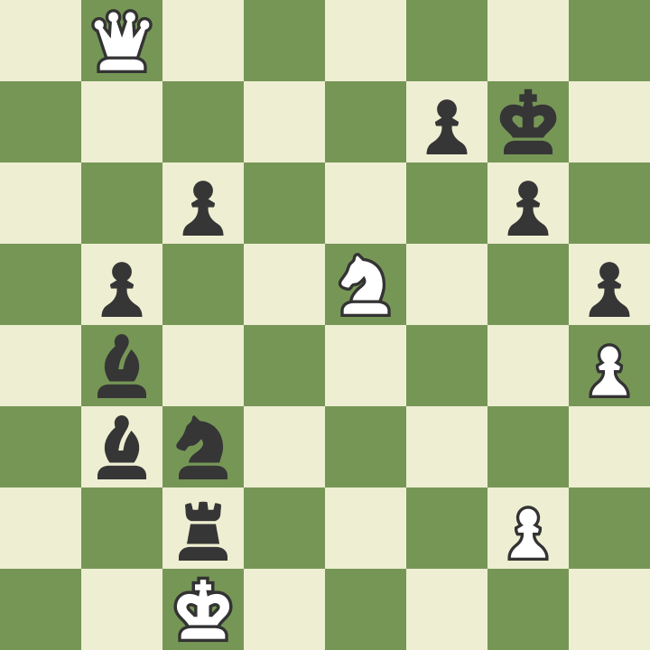

# Why Event sourcing?

Below is a straw man CRUD (update in place) banking database.
A snapshot of each account's current balances'.

| Id  | Name    | Balance |
| --- | ------- | ------- |
| 1   | Alice   | $250    |
| 2   | Bob     | $80     |
| 3   | Charlie | $19,820 |

If we looked again in `2 weeks` the results will be completely different as
transactions have occurred since.

| Id  | Name    | Balance |
| --- | ------- | ------- |
| 1   | Alice   | $40,850 |
| 2   | Bob     | $94     |
| 3   | Charlie | $20     |

Since no transactions are recorded and instead the original balance is overwritten
with the new balance after each transaction we lose the evidence of what happened.

Which means we can't ask questions like

* Why is my balance now $0, What did I spend it on?
* How much did I spend over Christmas?
* How much was I paid this month?

**Event Sourcing** aims to resolve those limitations by
instead recording each **event** that occurs to an **event log**
so we have a historical record of everything that happened.

## What is Event Sourcing?

> [!NOTE]
> Think Double-entry bookkeeping/Git/Redux and you're half way there.

Event sourcing is about recording each `Event` that occurs to an `Event Log`
making it the `Source of Truth`.

## Event Sourcing in action (Chess)

The Chess world uses `Chess notation` to record each move within a game
so games can be replayed later for review, where you can ask questions like
`"Where did I go wrong?", "What move should I have played at move 9?"` and
experiment playing different lines from different points in the game.
`What happens if I play Qb2 for move 6?`

* Chess Notation = Event
* Chess notation for game = Event Log
* Current board = Projection

```text
1. Nf3 Nf6 
2. c4 g6 
3. Nc3 Bg7 
4. ...
```



## Benefit (Temporal Query)

You wake up and discover you only have $10 left in your account.

> "Why the heck do I only have $10?!? I got paid last week!"

So you go and check your banking app's transactions from the **past couple days**.

| Date               | Description                | Amount  | Balance |
| ------------------ | -------------------------- | ------- | ------- |
| 31/10/2021 @ 12:00 | Paid                       | $2,500  | $3,000  |
| 1/11/2021 @ 06:00  | Bills                      | -$700   | $2,300  |
| 4/11/2021 @ 20:00  | Cinema                     | -$40    | $2,260  |
| 6/11/2021 @ 21:18  | 2 x Beers                  | -$20    | $2,240  |
| 6/11/2021 @ 22:51  | 2 x Beers + Crisp          | -$25    | $2,215  |
| 6/11/2021 @ 23:20  | Bob's money for last round | $25     | $2,240  |
| 6/11/2021 @ 23:32  | Whiskey                    | -$50    | $2,190  |
| 7/11/2021 @ 01:48  | Ebay (1989 Mazda MX5)      | -$2,180 | $10     |

Where you uncover you've drunkenly bought yourself an `1989 Mazda MX5`. "Uh oh..."

> [!NOTE]
> As your bank has recorded each transaction you can view whats happened

A Transaction log also means we can query transactions based on time.
In the example above to get the **current** balance we just totaled up each deposit
and withdrawal transaction.
But we could also ask questions like "How much did I spend this **month**"
or "How much did I make this **year**" and get different results from
the same data.

| Date               | Description                | Amount |
| ------------------ | -------------------------- | ------ |
| 31/10/2021 @ 12:00 | Paid                       | $2,500 |
| 6/11/2021 @ 23:20  | Bob's money for last round | $25    |

> Income: **$2,525**

| Date              | Description           | Amount  |
| ----------------- | --------------------- | ------- |
| 1/11/2021 @ 06:00 | Bills                 | -$700   |
| 4/11/2021 @ 20:00 | Cinema                | -$40    |
| 6/11/2021 @ 21:18 | 2 x Beers             | -$20    |
| 6/11/2021 @ 22:51 | 2 x Beers + Crisp     | -$25    |
| 6/11/2021 @ 23:32 | Whiskey               | -$50    |
| 7/11/2021 @ 01:48 | Ebay (1989 Mazda MX5) | -$2,180 |

> Outgoings: **$3,015**

* Transaction = Event
* Transaction Log = Event Log
* Total = Projection

## Benefit (Error handling)

Can model each step within a process individually.

* Process all files (Success or Fail)
* ES - Create event for each file, retry any failed event

## Benefit (Extensible)

Can create `notifier` to consume events and forward to no process

## Benefit (Retrofitting)

Can create projections from previous data.
You might realise a new opportunity from the data you've already collected since
we havn't binned anything we can still use that data.

## Glossary

* Event - Record of something that :fire: **happend** :fire: (past-tense)
* Event Log - Append-only Sequence of `Events` ordered by occurred
* Projection - Applying select `Events` from the `Event Log` to create a report
* Aggregate - Manage creation of `events` for something that has a Life cycle
* Injector - Consume `events` from an external services
* Notifier - Emit `events` to external services
* Process manager (Sage) - Manage process that requires many `events`
* Gateway - External service

## References

[Datomic: Event Sourcing without the hassle]([https://vvvvalvalval.github.io/posts/2018-11-12-datomic-event-sourcing-without-the-hassle.html#why_event_sourcing?])
