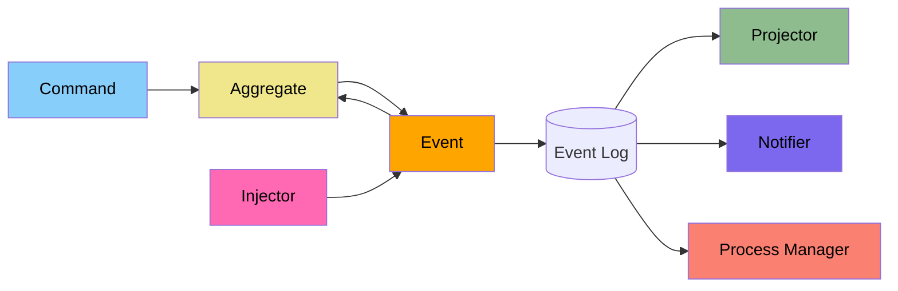
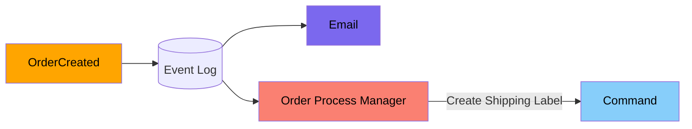

# (WIP) Event sourcing

Here is a basic `Stateful` CRUD (update in place) banking database.
It serves as a snapshot of each account's :fire: **current** :fire: balances.

| Id  | Name    | Balance |
| --- | ------- | ------- |
| 1   | Alice   | $250    |
| 2   | Bob     | $80     |
| 3   | Charlie | $19,820 |

If we looked again in `2 weeks` the results will be completely different as
transactions have occurred since.

| Id  | Name    | Balance |
| --- | ------- | ------- |
| 1   | Alice   | $40,850 |
| 2   | Bob     | $94     |
| 3   | Charlie | $20     |

Without transaction records and overwritten balances, we lose all evidence.

So we can't ask questions like

* Why is my balance $0, What did I spend it on?
* Why is my bank account locked?

## What is Event Sourcing?

> [!NOTE]
> Think Double-entry bookkeeping/Git/Redux and you're half way there.

Event sourcing is about recording each `Event` that occurs to an `Event Log`
making it the `Source of Truth`.



```csharp
class BankAccountAggregate(Events events) {
  private int _balance = 0;  

  public void Apply(Deposited event) {
    this._balance += event.value;
  }

  public void Apply(Withdrew event) {
    this._balance -= event.value;
  }

  public void Handle(Withdraw command) {
    if (this._balance >= command.amount) {
      events.Raise(new Withdrew(command.amount))
    }
  }
}

class Projection(Events events) {
  public int SpendingProjection() {
    return events.reduce(state, event => {
      if (event.type == "Withdrew")
        state += event.value
    });
  }
}
```

## Event Sourcing used else where (Chess)

The Chess world uses `Chess notation` to record each move within a game
so games can be replayed later for review, where you can ask questions like
`"Where did I go wrong?", "What move should I have played at move 9?"` and
experiment playing different lines from different points in the game.
`What happens if I play Qb2 for move 6?`

* Chess Notation = Event
* Chess notation for game = Event Log
* Current board = Projection

```text
1. Nf3 Nf6 
2. c4 g6 
3. Nc3 Bg7 
4. ...
```


## Benefit (Temporal Query)

You wake up and discover you only have $10 left in your account.

> "Why the heck do I only have $10?!? I got paid last week!"

So you go and check your banking app's transactions from the **past couple days**.

| Date               | Description                | Amount  | Balance |
| ------------------ | -------------------------- | ------- | ------- |
| 31/10/2021 @ 12:00 | Paid                       | $2,500  | $3,000  |
| 1/11/2021 @ 06:00  | Bills                      | -$700   | $2,300  |
| 4/11/2021 @ 20:00  | Cinema                     | -$40    | $2,260  |
| 6/11/2021 @ 21:18  | 2 x Beers                  | -$20    | $2,240  |
| 6/11/2021 @ 22:51  | 2 x Beers + Crisp          | -$25    | $2,215  |
| 6/11/2021 @ 23:20  | Bob's money for last round | $25     | $2,240  |
| 6/11/2021 @ 23:32  | Whiskey                    | -$50    | $2,190  |
| 7/11/2021 @ 01:48  | Ebay (1989 Mazda MX5)      | -$2,180 | $10     |

Where you uncover you've drunkenly bought yourself an `1989 Mazda MX5`. "Uh oh..."

> [!NOTE]
> As your bank has recorded each transaction you can view whats happened

A Transaction log also means we can query transactions based on time.
In the example above to get the **current** balance we just totaled up each deposit
and withdrawal transaction.
But we could also ask questions like "How much did I spend this **month**"
or "How much did I make this **year**" and get different results from
the same data.

| Date               | Description                | Amount |
| ------------------ | -------------------------- | ------ |
| 31/10/2021 @ 12:00 | Paid                       | $2,500 |
| 6/11/2021 @ 23:20  | Bob's money for last round | $25    |

> Income: **$2,525**

| Date              | Description           | Amount  |
| ----------------- | --------------------- | ------- |
| 1/11/2021 @ 06:00 | Bills                 | -$700   |
| 4/11/2021 @ 20:00 | Cinema                | -$40    |
| 6/11/2021 @ 21:18 | 2 x Beers             | -$20    |
| 6/11/2021 @ 22:51 | 2 x Beers + Crisp     | -$25    |
| 6/11/2021 @ 23:32 | Whiskey               | -$50    |
| 7/11/2021 @ 01:48 | Ebay (1989 Mazda MX5) | -$2,180 |

> Outgoings: **$3,015**

* Transaction = Event
* Transaction Log = Event Log
* Total = Projection

## Benefit (Resiliency)

A naive approach would be to put both processes in one `handler`.

```javascript
function handlePlaceOrder() {
  const transaction = createTransaction();
  const shipping = createShippingLabelAsync();
  const email = emailCustomerConfirmationAsync();

  await shipping.catch(e => transaction.revert());
}
```

But what happens if

1. Shipping label fails? We've already sent an email confirmation out.
1. Email fails? We can't retry as that would create another shipping label.


<!-- TODO: Expand -->
By having an `Event log` and committing each state change as an `Event`
we're known that step has occurred and other processes can operate from
that

So with the earlier what if's

1. Shipping label fails? We can retry independently
1. Email fails? We can retry independently

## Benefit (Extensible)

Can create `notifier` to consume events and forward to no process

## Benefit (Retrofitting)

Can create projections from previous data.
You might realise a new opportunity from the data you've already collected since
we haven't binned anything we can still use that data.

## Glossary

* Command - Request for something to happen (Operation can fail)
* Event - Record of something that :fire: **happend** :fire: (past-tense)
* Event Log - Append-only Sequence of `Events` ordered by occurred
* Aggregate - Groups related `events` from `Event Log` together to
represent some business object. Use's internal state to validate incoming commands.
(Can't withdraw when account balance is $0)
* Projection - Groups related `events` from the `Event Log` together to
create a report. Use's Internal state to help generate report.
* Injector - Consume `events` from an external services
* Notifier - Reads `Event log` and emit `events` to external services

* Process manager (Saga) - Manage process that requires many `events`
* Gateway - External service

## References

[Datomic: Event Sourcing without the hassle]([https://vvvvalvalval.github.io/posts/2018-11-12-datomic-event-sourcing-without-the-hassle.html#why_event_sourcing?])
