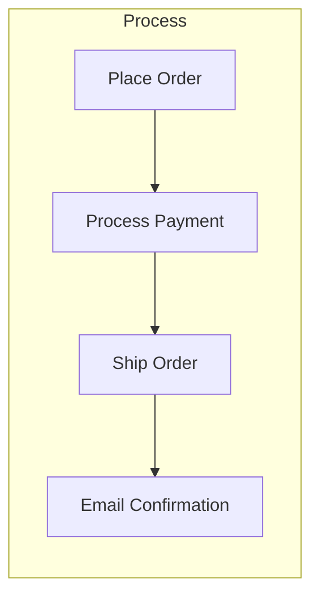
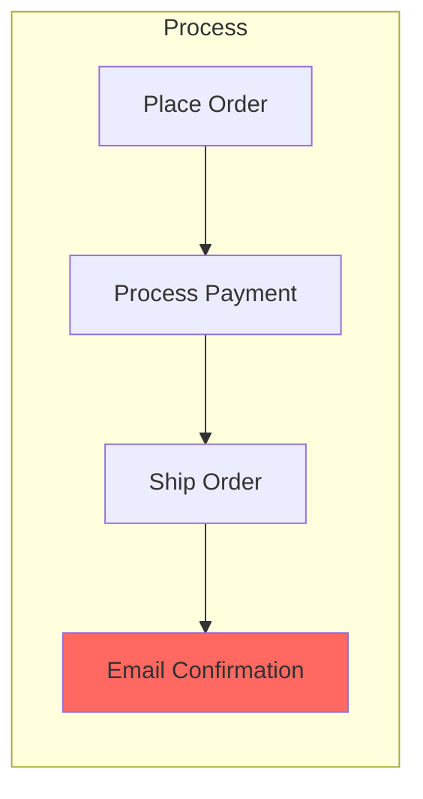
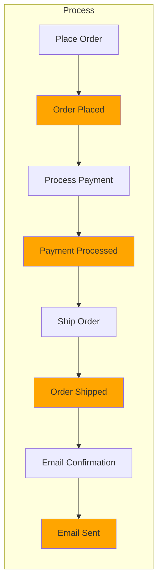
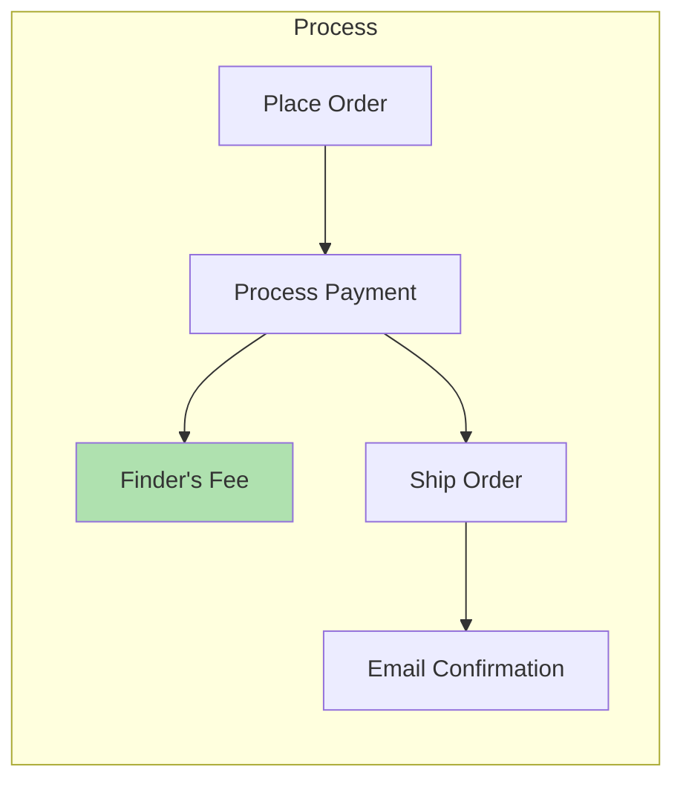
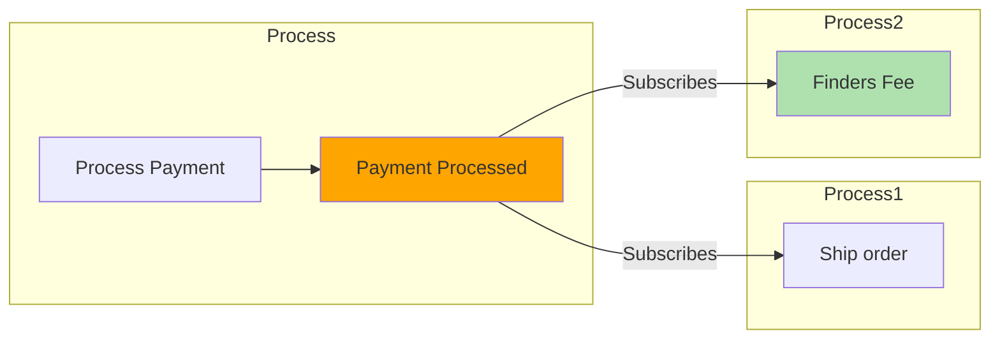
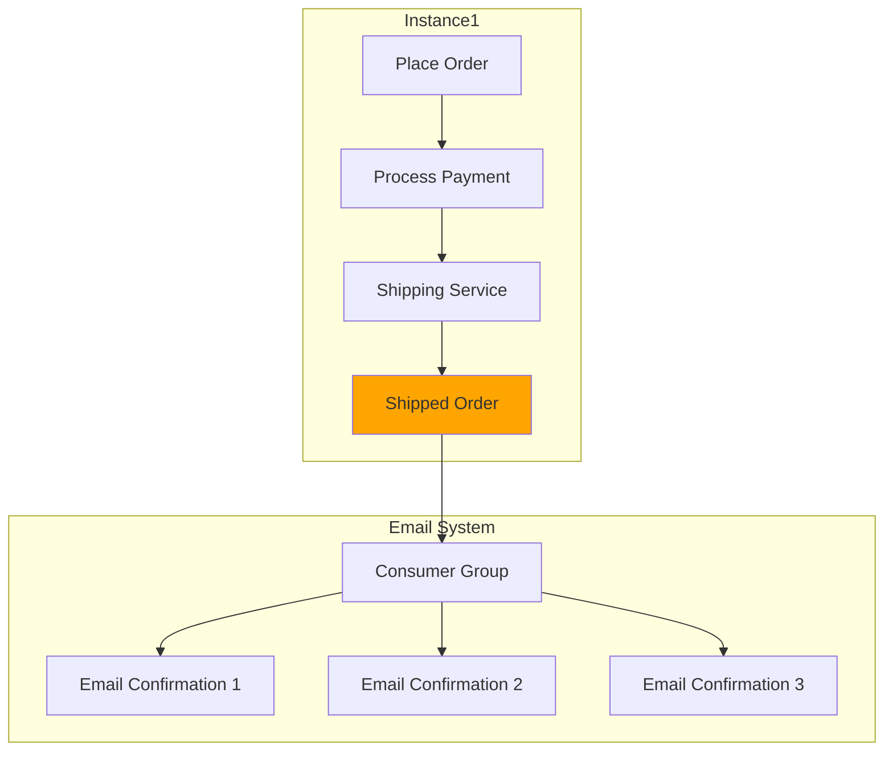
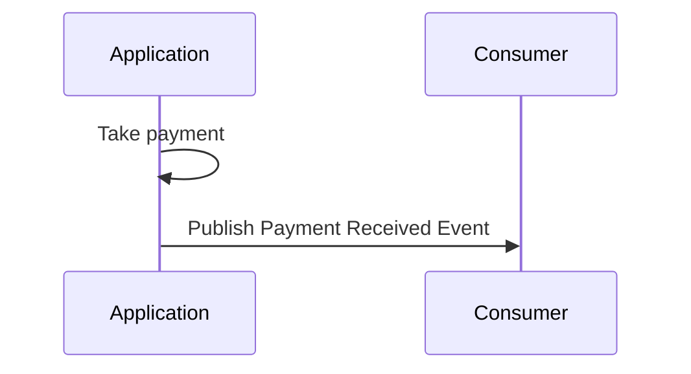
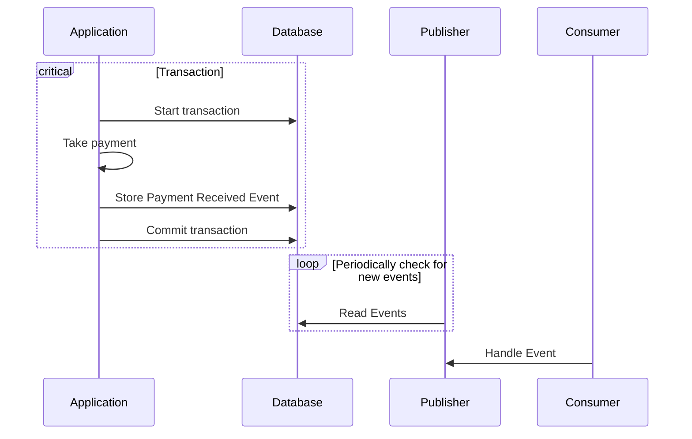

# Events

Typical business process



```clojure
(defn process [request]
    (-> request
        (place-order)
        (process-payment)
        (ship-order)
        (send-email)))
```

## Resilience

> [!WARNING]
> What happens if any step fails?
> `place order`, `payment`, `ship`, or `send confirmation` can each fail



What happens if `email confirmation` fails?
We can't retry the entire process again as that would create multiple orders,
charging the customer twice.

Instead by exposing `events` between each step we `decouple` everything.
If any step fails we can retry it independently.



`Events` isolate steps from each other (Creating save points between each step).
Now if the `email confirmation` fails we can retry from the `order shipped` event
and retry sending the email again.

## Extensibility

Now we need to add a referral program, adding a `finders fee` for each purchase.
So we need to update and reploy our current implementation



Instead by using `events` we can extend our system without changing our
current implementation.
We can add a new `finder’s fee` step that subscribes to the
`payment processed` event.



## Scalability + Availability

> [!WARNING]
> What happens if the email process is overwhelmed with requests

The orginal process would require scaling vertically to match demand.

Instead by exposing events it's allows scaling horizontally by adding more subscribers.
So if the `email` step is slow we can add more `email consumers`.



## Outbox pattern

A simplistic event driven architecture.



> [!WARNING]
> What happens if `Take payments` fails but pubish the `Payment Received` event?
> [!WARNING]
> what happens if `Take payment` succeeds but don't publish the `Payment Received` event?

Both `Command` and `Store event` should be performed within a transaction,
and only committed if both processes succeed to prevent any inconsistencies.

The `Producer` should store any `events` it produces so that it can continue
to run even if consumers are down and unable to accept `events`.
`Consumers` can catch up and process the `events` when they are ready.


