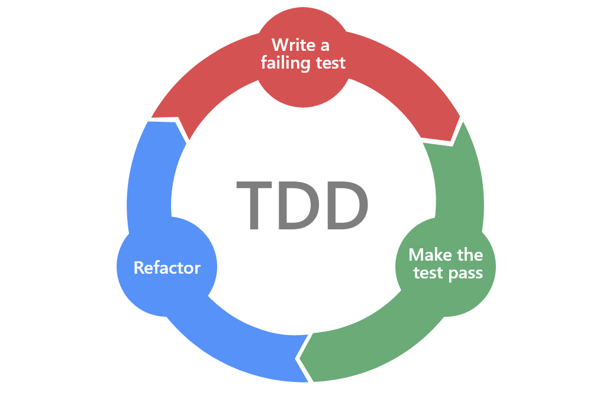
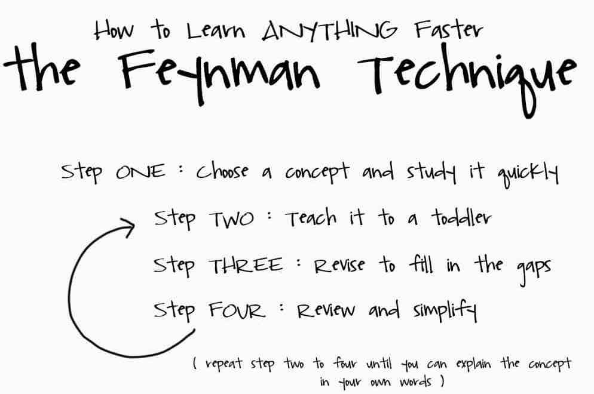

# How to learn

* What
  * 80/20 rule (Prioritise, Gaps in knowledge, Need to know)
* Learning
  * Flow state (Focused, Pomodoro)
  * Timebox
  * Set measurable goal
* Notes, questions, thoughts about content
  * How can I use this?
  * How does it relate to what I already know?
  * When will I use this?
  * Why must I use this?
* Understand
  * Feynman technique (Teach + Highlights gaps)
  * Diagrams
  * Apply in real world situation
* Remember what you learn
  * Spaced repetition (6hr, 24hr, 3d, 7d, 14d)
  * Flashcards

