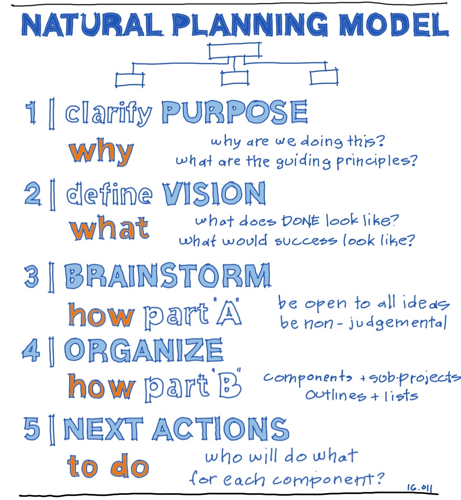
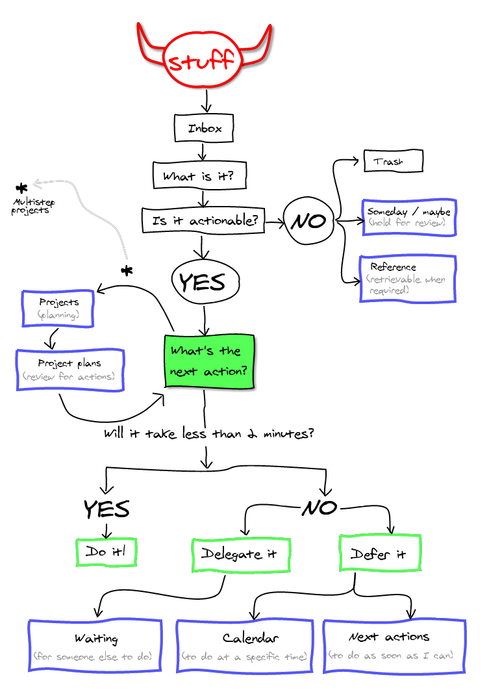

# Planning

## Mindset

- Identify with what you want to be
- Growth mindset (Believe)
- Only focus on what's in your control
- Never right time
- Best for business

## Feedback

- Future goals
  - Interest, Purpose, Future self
- Yearly/Quarterly/Weekly/Daily review
  - Am I working towards future goal?
  - Fear setting (What happens if I don't do this?)
  - Kaizen (Which actions should I pick or drop?)
  - Visualize progress
  - Daily
    - 1 thing I can do to day to work today's future goal
    - List actions for tomorrow's TODO list to switch off

## Planning

## Novelty

