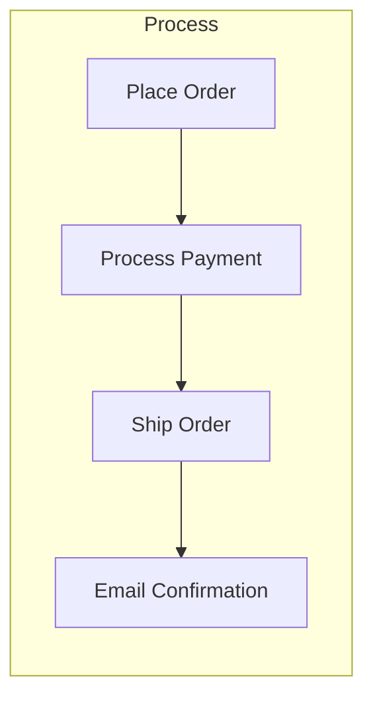
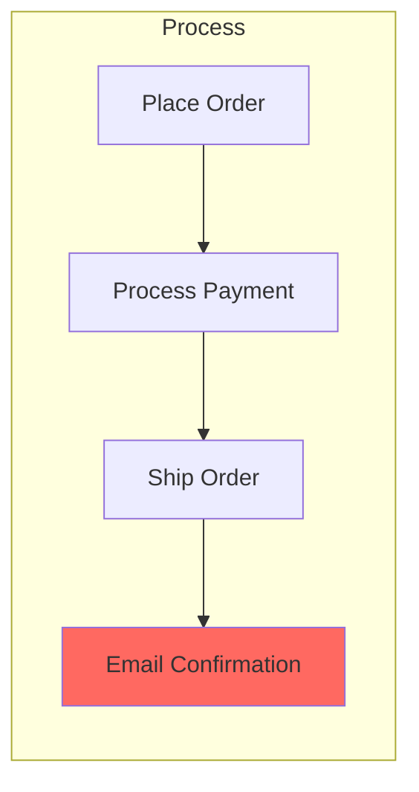
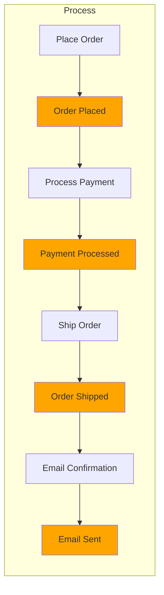
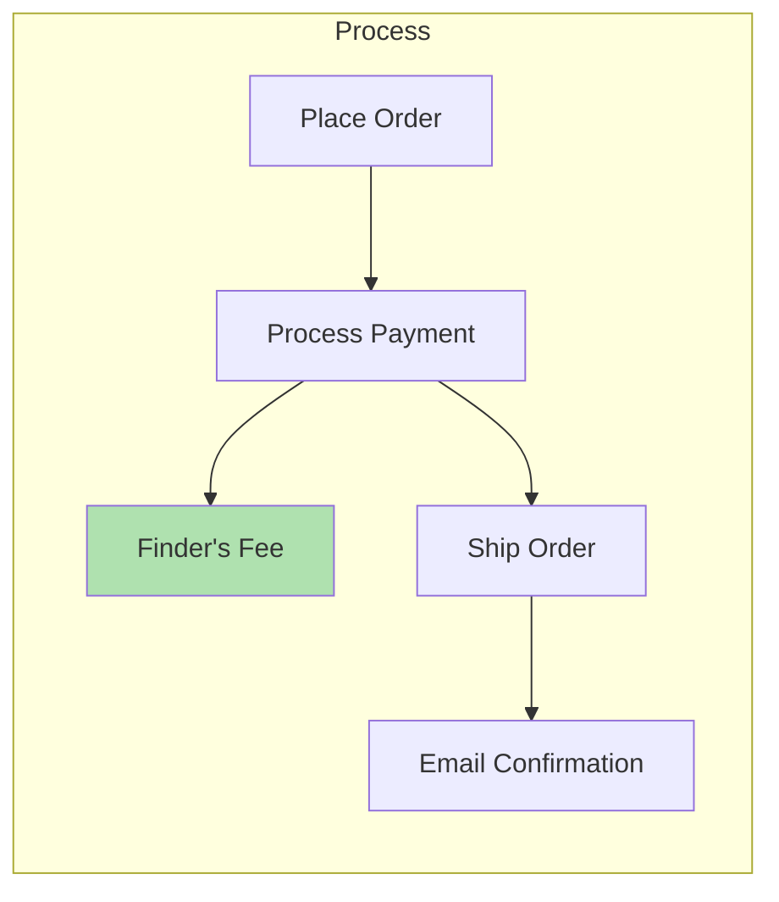
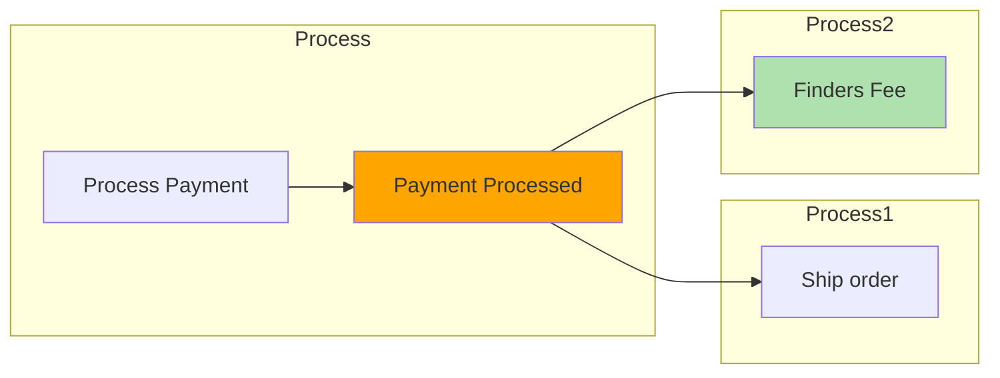
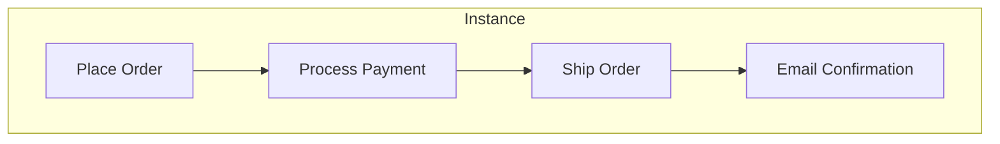
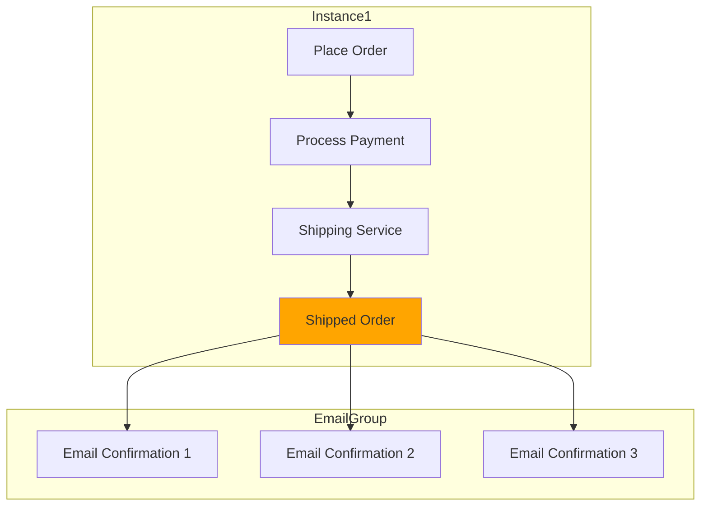

# Events

Typical single process



```clojure
(defn process [request]
    (-> request
        (place-order)
        (process-payment)
        (ship-order)
        (send-email)))
```

## Resilience

> [!WARNING]
> What happens if any of these steps fail?
> As `place order`, `payment`, `ship`, or `send confirmation` could all fail.



What happens if `email confirmation` fails?
We can't retry as that would create multiple orders and the customer would
be charged twice.

Instead decoupling each step from each other with `events` means we can retry
each independently? so if any one steps fails we can retry that independently.



Instead if we used `events` to communicate we isolate each step from each other, basically creating save points between each step. Now if the `email confirmation` fails we can retry from the `order shipped` event and retry sending the email again. |

## Extensibility

Our current shipping process.


We add a referral program, adding a `finders fee` for each purchase.
So we need to update and reploy our current implementation



Instead by using `events` we can extend our system without changing our
current implementation.
We can add a new `finder’s fee` step that subscribes to the
`payment processed` event.



## Scalability

Our current shipping process.



It also allows us to scale each step independently.
The current implementation requires scaling vertically whereas
with `events` we can scale horizontally.
So for example if the `email` step is slow we can scale that independently.


