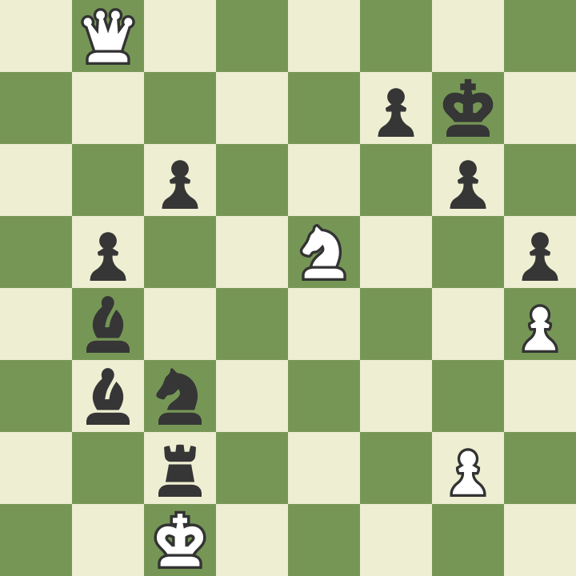

# (WIP) Event sourcing

Record everything that happens.

## Story time

You wake up and discover you only have $2 left in your account.

> "Why the heck do I only have $2?!? I got paid last week!"

So you go and check your banking app's transactions.

> "There's when I got paid from last week, paid the bills for the month,
> Cinema on Tuesday..."

Then you uncover that after you went out for drinks last night you've
drunkenly ordered yourself an `1989 Mazda MX5`.

> "Uh oh..."

The only reason you found out what happened is because you can see each
transaction, if it was only your balance you would be clueless.

## PLace Oriented Programming (PLOP)

Here's a bank account database table.

| Id  | Name    | Balance |
| --- | ------- | ------- |
| 1   | Alice   | $250    |
| 2   | Bob     | $80     |
| 3   | Charlie | $420    |

However, this is only a snapshot of the current state at the moment,
if you looked again in `2 weeks` it would look different as we are updating
the rows in place (PLOP).
So we can't ask questions like
`How did we get here?` or `What was the previous state?`.

Instead `Event sourcing` records each `event` that has occurred and `projects`
the `current state` by replaying all of those `events`.

## (WIP) Event sourcing

Recording each transaction that occurred (Double Entry book keeping) is
`Event sourcing` whereas applying `PLOP` and not recording

## Usage: Chess Notation

The Chess world use `Chess notation` to record each move so games can be
replayed and reviewed.
`"Where did I go wrong?", "What move should I have played?"`.
In `Event sourcing` terms, `Chess notation` is the `event log`,
each move is an `event`, and the chess board is the
`projection` (current state) depending on what moves you've played so far.

```text
1. Nf3 Nf6 2. c4 g6 3. Nc3 Bg7 4. d4 O-O 5. Bf4 d5 6. Qb3 dxc4 7. Qxc4 c6 8. e4 Nbd7 9. Rd1 Nb6 10. Qc5 Bg4 11. Bg5 Na4 12. Qa3 Nxc3 13. bxc3 Nxe4 14. Bxe7 Qb6 15. Bc4 Nxc3 16. Bc5 Rfe8+ 17. Kf1 Be6 18. Bxb6 Bxc4+ 19. Kg1 Ne2+ 20. Kf1 Nxd4+ 21. Kg1 Ne2+ 22. Kf1 Nc3+ 23. Kg1 axb6 24. Qb4 Ra4 25. Qxb6 Nxd1 26. h3 Rxa2 27. Kh2 Nxf2 28. Re1 Rxe1 29. Qd8+ Bf8 30. Nxe1 Bd5 31. Nf3 Ne4 32. Qb8 b5 33. h4 h5 34. Ne5 Kg7 35. Kg1 Bc5+ 36. Kf1 Ng3+ 37. Ke1 Bb4+ 38. Kd1 Bb3+ 39. Kc1 Ne2+ 40. Kb1 Nc3+ 41. Kc1 Rc2# 0-1
```



## Pros

- Record everything that happened

## Cons

- More effort
