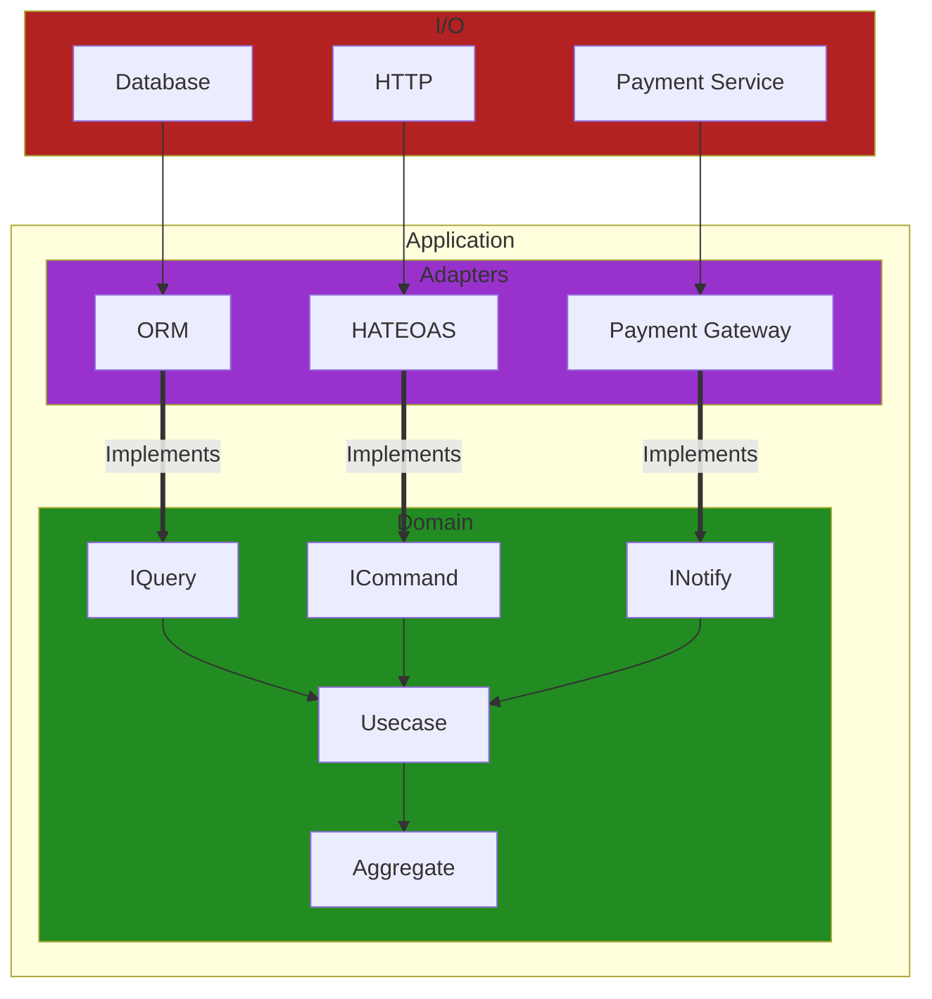

# Structure

## Imperative Shell, Functional Core

You don't want `I/O` code in your `domain`.

* Harder to read. Introduces lots of specific `I/O` code.
* Difficult to take out later if you change `I/O`.
* Difficult to test as you're calling `I/O` directly.
* Can fail, Have to handle exceptions.

```diff
## Red - Impure (Uses with I/O)
## Green - Pure (Same input, Same output)

function compareInputs(){
- var number1 = Console.Readline();
- var number2 = Console.Readline();

+ var result = compare(number1, number2)

+ if (result > 0)
-   Console.WriteLine("Number1 is bigger")
+ else if (result < 0)
-   Console.WriteLine("Number1 is smaller")
+ else
-   Console.WriteLine("Same")
} 
```

Instead we can split the `pure` code out.

* Easier to read. (No console required)
* We can reuse the `compareNumbers` in different contexts.
* Easier to test. (No console required)
* No unexpected results

```diff
function compareNumbers(number1, number2) {
+ if (number1 > number2)
+   return "Number1 is bigger"
+ else if (number1 < number2)
+   return "Number1 is smaller"
+ else
+   return "Same"
} 

function shell(){
- var number1 = Console.Readline();
- var number2 = Console.Readline();

+ var result = compare(number1, number2)

- Console.WriteLine(result)
} 
```

Below is an example function which includes `I/O`
specific code within the domain.

* Hard to read as we have `payment` specific code within the `domain` of
`processing an order`.
* What if our 3rd party payment provider decides they want a 50% cut of all sales?
Now we need to remove every instance of the `Client` throughout our system and replace
with another provider.
* How do we test this function? We are creating a payment each time.
Also it doesn't return anything, how do assert something when we don't know the result?

```javascript
function process(order) {
  // validate order

  const paymentClient = FooPaymentClient();
  paymentClient.connect(TOKEN);
  paymentClient.create({
    type: 'payment',
    product: orderId.productId
  });

  // notify customer
}
```



> The overriding rule that makes this architecture work is The Dependency Rule.
> This rule says that source code dependencies can only point inwards.
> Nothing in an inner circle can know anything at all about
> something in an outer circle.
> [...]
> We don’t want anything in an outer circle to impact the inner circles.
>
> [Uncle Bob - The Clean architecture](https://blog.cleancoder.com/uncle-bob/2012/08/13/the-clean-architecture.html)
> [!NOTE]
> Test at the boundaries of a system. Not the internals.
> Tests should be done at the `workflow` level.
> `Unit` produces no side effects and runs in isolation

* Benefits
  * Framework agnostic
    * Can change `Adapters` out without changing `Domain`.
  * Testable
    * Can test `Domain` without `I/O` (Database, HTTP, Service)

* References
  * [Functional core, Imperative shell](https://www.destroyallsoftware.com/screencasts/catalog/functional-core-imperative-shell)
  * [Sandwich  architecture](https://blog.ploeh.dk/2023/10/09/whats-a-sandwich/)
  * [Clean Architecture](https://blog.cleancoder.com/uncle-bob/2012/08/13/the-clean-architecture.html)
  * [Port and Adapters](https://alistair.cockburn.us/hexagonal-architecture/)
  * [Moving IO to the edges of your app: Functional Core, Imperative Shell - Scott Wlaschin](https://www.youtube.com/watch?v=P1vES9AgfC4)

## Feature Cohesion

* Examples
  * Screaming Architecture
  * Vertical Slice Architecture
  * Modular Monolith

## Glossary

* I/O (Input/Output)
  * Non-deterministic output. (random-number)
* Workflow / Use case / Story
  * Process that fulfils expected outcome
