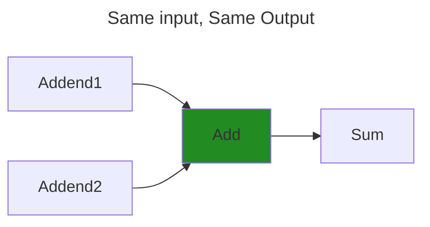
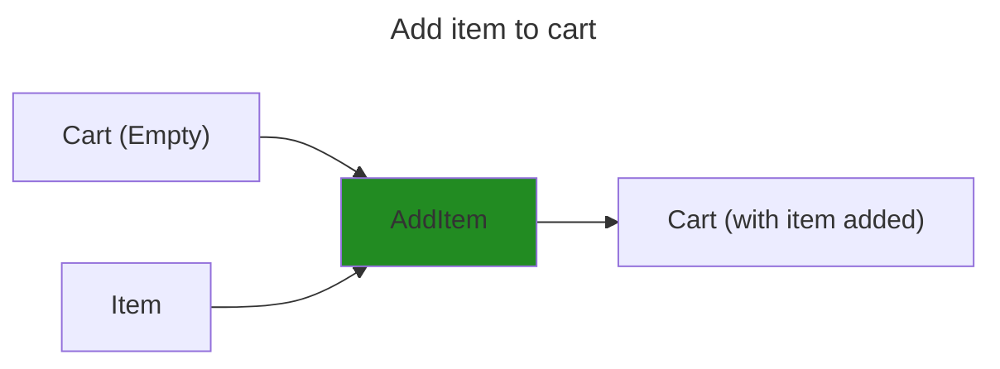
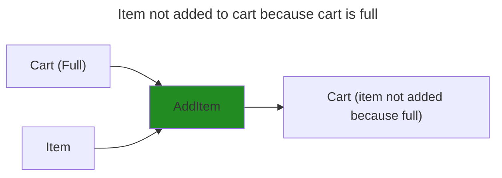
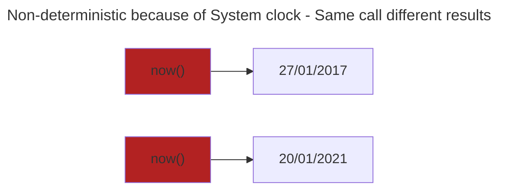
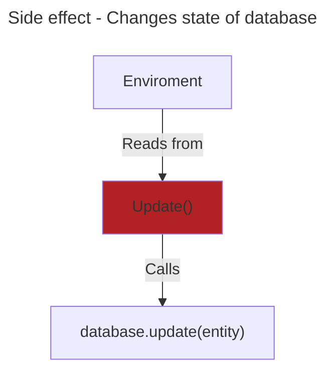
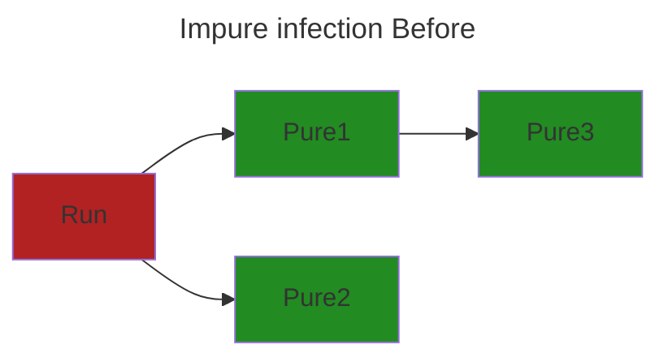
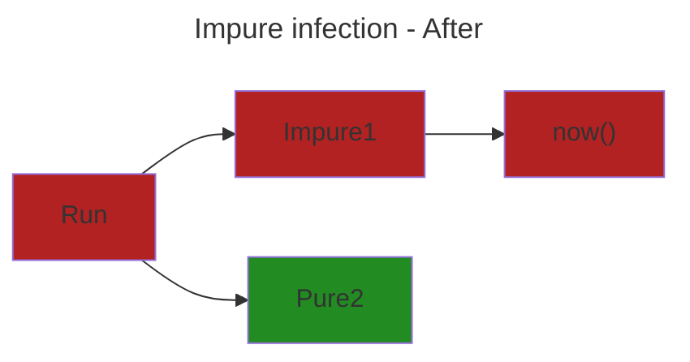
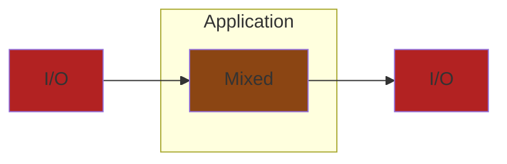
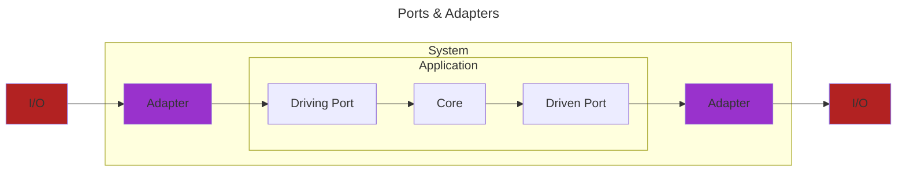

# (WIP) Structure
<!-- mtoc-start -->

* [Decouple Pure and Impure code](#decouple-pure-and-impure-code)
  * [What is Pure code](#what-is-pure-code)
  * [What is Impure code](#what-is-impure-code)
  * [Why the `Pure` and `Impure` language](#why-the-pure-and-impure-language)
  * [Prefer pure](#prefer-pure)
  * [Decouple Pure and Impure References](#decouple-pure-and-impure-references)
* [Decouple Domain from External details](#decouple-domain-from-external-details)
  * [Appeal to Authority for Decoupling Domain from External](#appeal-to-authority-for-decoupling-domain-from-external)
  * [Ports and Adapters](#ports-and-adapters)
  * [Decoupling Driving External Details from Domain](#decoupling-driving-external-details-from-domain)
  * [Decoupling Domain from outgoing External contract](#decoupling-domain-from-outgoing-external-contract)
  * [General architecture (Clean, Port and Adapters)](#general-architecture-clean-port-and-adapters)
  * [Decouple Domain and External](#decouple-domain-and-external)
* [(WIP) Feature Cohesion](#wip-feature-cohesion)
  * [Feature Cohesion Examples](#feature-cohesion-examples)
* [Glossary](#glossary)

<!-- mtoc-end -->

## Decouple Pure and Impure code

[TODO]: Why decoupling Pure and Impure code is important

### What is Pure code

`Pure` = Deterministic + No side effects

Given the same input you will always receive the same output,
regardless of how many times it's called or when it's called.

It also means it doesn't perform any `Side effects` ([more](#what-is-impure-code)).







### What is Impure code

`Impure` = Non-deterministic because of external dependencies
and/or performs `Side effect`



`Side effect` = Interacts with the external system and/or changes state



An object's method that changes its state is another example of an `impure` operation

* Calling `user.GetName()` returns `Alice`
* `user.UpdateName(Bob)` changes the state of the `user` object
* Calling `user.GetName()` again now returns a different result `Bob`
* Making `user.GetName()` non-deterministic
* `user.UpdateName()` is `impure` as it changed the state of `user`

However, We still need to interact with `Impure` sources to get stuff done.

* Storing/Querying a Databases
* Sending emails
* Getting the current time

### Why the `Pure` and `Impure` language

`Impure` code calling `Pure` code remains `Pure`.
`Pure` code calling `Impure` code becomes `Impure`,
as the call is non-deterministic, making it non-deterministic.





### Prefer pure

With all that in mind, prefer `Pure` code over `Impure` code.
As it's easier to reason and test because it's deterministic.

I've created a simple code example that mixes the two.
It's game were you have to guess if the next card is higher or lower.
(Like Play Your Cards Right)

I've highlighted which parts are `Pure` and `Impure`

* Red - `Impure` code
* Green - `Pure` code

```diff
// Function to generate a random card value between 1 and 13
- function generateCard() {
-  return Math.floor(Math.random() * 13) + 1;
-}

// Function to start the game
function playGame() {
-  const currentCard = generateCard();
-  console.log(`Current card: ${currentCard}`);

  // User's guess
-  const userGuess = prompt("Will the next card be higher or lower or same? (h/l/s)");

-  const nextCard = generateCard();
-  console.log(`Next card: ${nextCard}`);

+  if ((userGuess === 'h' && nextCard > currentCard) || 
+      (userGuess === 'l' && nextCard < currentCard) ||
+      (userGuess === 's' && next == currentCard) {
-    console.log("You guessed it right!");
+  } else {
-    console.log("Sorry, you guessed it wrong.");
  }
}

// Call the playGame function to start the game
playGame();
```

So the above `playGame` holds a lot of complexity.

* Handling user input
  * `3` (`h|l|s`) permutations
* Generating random cards
  * `13` (`1,2,..,13`) permutations
* Comparing the cards
  * `169` (`13x13`) distinct pairs
* Comparing the user input with the comparison
  * `507` (`169 * 3`) guesses and comparisons

`507` possible outcomes (that's even ignoring errors).
Ideally we should test the edge cases to make sure it works.

| Guess | Current Card | Next Card | Correct? |
| ------------- | -------------- | -------------- | ----- |
| Higher | 1 | 2 | Yes |
| Lower | 1 | 2 | No |
| Same | 1 | 2 | No |
| ... | ... | ... | ... |

However, adding tests for this code is difficult

* `Console` is required for input and output
* Code generates random cards making it non-deterministic

Instead by splitting out the `Pure` logic from
the `Impure` code it makes it easier to test.

```diff
function compare(userGuess, currentCard, nextCard) {
+  if (userGuess === 'h' && nextCard > currentCard ||
+      userGuess === 'l' && nextCard < currentCard ||
+      userGuess === 's' && nextCart == currentCard)
+   return "Correct";
+  return "Sorry, you guessed wrong"
}

function playGame() {
-  const currentCard = generateCard();
-  console.log(`Current card: ${currentCard}`);

  // User's guess
-  const userGuess = prompt("Will the next card be higher or lower? (h/l)");
-  const nextCard = generateCard();
-  console.log(`Next card: ${nextCard}`);

+  const result = compare(userGuess, currentCard, nextCard);

-  console.log(result);
  }
}

// Tests
+ [2, 1, "h"]
+ [1, 2, "l"]
+ [1, 2, "s"]
+ .. many more test cases here ...
+ test("Invalid guesses", (guess, current, next) => {
+  const actual = compare(guess, current, next)
+  expect(actual).is("Sorry, you guessed wrong")
+})
```

* Easier to read
  * Can read `compare (Pure)` logic without any `Impure` context
* Easier to automated test
  * No Console required (Avoids manual testing)
  * No stubbing of random card generator
  * Just input and expected output. (Parameterized tests)
* Reuse `compare` in different contexts
  * Currently uses `Console`
  * Could be used in a `RESTFUL` API instead
* No unexpected results
  * Deterministic
  * Same input, Same output

### Decouple Pure and Impure References

* [Moving IO to the edges of your app: Functional Core, Imperative Shell - Scott Wlaschin](https://www.youtube.com/watch?v=P1vES9AgfC4)
* [Functional core, Imperative shell - Gary Bernhardt](https://www.destroyallsoftware.com/screencasts/catalog/functional-core-imperative-shell)
* [Sandwich  architecture - Mark Seemann](https://blog.ploeh.dk/2023/10/09/whats-a-sandwich/)
* [Solving Problems the Clojure Way - Rafal Dittwald](https://www.youtube.com/watch?v=vK1DazRK_a0)

## Decouple Domain from External details

Changes to external processes shouldn't impact internal processes.

Changes to internal processes shouldn't impact external processes.

`Internals` = The Domain (DDD).
The business rules that are important to you.
(Also called `Application` in Ports & Adapters or `Core` in Clean Architecture)

`External` =
> An external system is basically one whose interface your team can't change.
Any off-the-shelf purchased products, third party libraries, databases,
and subsystems defined by other teams, are external systems.

[Alistair Cockburn - Hexagonal Architecture Explained](https://store7710079.company.site/Hexagonal-Architecture-Explained-p655931616)
Some examples External systems.

| Protocol | Media | Structure |
| --- | --- | --- |
|  HTTP | JSON | Database Schema |
|  GRPC | ProtoBuf |  SaaS API model |
|  SOAP | XML | |
|  Websocket | | |

Benefits of decoupling `Domain` from `External Systems`

* Design
  * Focus on `Domain` design without technology detail distractions
  * Not constrained by `External` systems designs or availability
  * Create your own preferred interface to working with `External` systems
  * Change `External` system without changing `Domain`
  * Change `Domain` model without breaking contract with `External` consumers
* Testing
  * Test `Domain` end-to-end without `External` systems (Database, HTTP, API)

### Appeal to Authority for Decoupling Domain from External

> Don't allow Externals (you don't control) to couple to the internals (you do control)

[CodeOpinion - DTOs & Mapping](https://www.youtube.com/watch?v=FKFxWrwdAWc)

* > The whole point of the Ports & Adapters architecture is that the
application is oblivious to the external connections.

* > The pattern says, "Put an API around everywhere and separate the inside
from the outside"

* > Ports & Adapters ... Says the `app` can have no knowledge of what its
`external` connections are made of. [...] All the compile-time dependencies
point inward to the `app`, with none coming from the `app`to the `external` `actors`

* > Ports & Adapters [...] puts all `external` technologies outside the app,
so that the inside only contains domain concepts. From there, you can do
domain-driven design without distraction.

[Alistair Cockburn - Hexagonal Architecture Explained](https://store7710079.company.site/Hexagonal-Architecture-Explained-p655931616)
> The overriding rule that makes this architecture work is The Dependency Rule.
> This rule says that source code dependencies can only point inwards.
> Nothing in an inner circle can know anything at all about
> something in an outer circle.
> [...]
> We don’t want anything in an outer circle to impact the inner circles.

[Uncle Bob - The Clean architecture](https://blog.cleancoder.com/uncle-bob/2012/08/13/the-clean-architecture.html)

### Ports and Adapters

`Adapter` =

* Adapts `External` -> `Domain`
* Adapts `Domain` -> `External`

Glossary

* Application (App) - Business logic. No reference to any technologies
* Port - Interface into Application. Port captures the Idea of a conversation
* Actors - External entities that interact with the system. (Behaviour)
  * Driving Actor - Call Application. (UI, Human, System)
  * Driven Actor - Application calls (System, Database, Gateway)
* Adapters - Conforms `Actor` to Driving `Port`, Conforms `Domain` to Driven `Port`
* Configurator - Composes everything together

### Decoupling Driving External Details from Domain



I've created an example to demonstrate Driving `Adapters`.
Using the same game as before but this time for `HTTP`
and saving to `PostGres`.

I've highlighted which parts are `Domain` and `External`

* Red - `External`
* Green - `Domain`

```diff
function compare(HttpRequest request, nextCard) {
-  const currentCard = request.body.currentCard;
-  const userGuess = request.body.userGuess;

+  if (userGuess === 'h' && nextCard > currentCard ||
+      userGuess === 'l' && nextCard < currentCard ||
+      userGuess === 's' && nextCart == currentCard)
+   return "Correct";
+  return "Sorry, you guessed wrong"
}

function PlayGameHttp(HttpRequest request) {
-  const postGres = new PostGres("connection-string")
   const nextCard = generateCard();

+  const result = compare(request, nextCard);

-  postGres.save(result);
-  return HttpResponse(result);
}
```

This has problems with `Coupling` specific details about
`HTTP`, `PostGres` with our `Domain` logic

* What if we stop using `Http` or `PostGres`
* What if we want to use `GRPC` and `Mongo`
* We don't want `HTTP` details contaminating our `Domain`
* We don't want our `Domain` knowing about `External` details

This is where `Ports and Adapters` comes in.
We create `Adapters` that handle `specific implementation details` and
converts them to `Domain` concepts and vice versa.

```diff
function postGresDatabase() {
-  const postGres = new PostGres("connection-string")

-  return {
-    save: (fn [data] postGres.save(data))
-  }
}

function compare(userGuess, currentCard, nextCard) {
+  if (userGuess === 'h' && nextCard > currentCard ||
+      userGuess === 'l' && nextCard < currentCard ||
+      userGuess === 's' && nextCart == currentCard)
+   return "Correct";
+  return "Sorry, you guessed wrong"
}

function play(Database database, HttpRequest request) {
  const nextCard = generateCard();
- const currentCard = getCard(request.body);
- const userGuess = getGuess(request.body);

+  const result = playgame(userGuess, currentCard, nextCard);

-  database.save(game, report);
}

function main(){
  var database = postGresDatabase();
  
  route("/play", (request) => {
    play(database, request);
  })
}
```

Now `compare` doesn't know anything about `HttpRequest` it just takes
data, so it can be used in different contexts like a `RPC` application instead.
It also makes it easier to test as we don't have to create a `HttpRequest`
for our tests.

We also pass in a `Database` implementation so we can use different implementations.
Especially useful for testing as you can pass in a `Mock` instead.
`Strategy Pattern/Dependency Injection`

### Decoupling Domain from outgoing External contract

If you return your Domain model

* Changing Domain breaks contract with clients
* Limit your domain model as you have to conform to contract

### General architecture (Clean, Port and Adapters)




### Decouple Domain and External

* [Sandwich  architecture - Mark Seemann](https://blog.ploeh.dk/2023/10/09/whats-a-sandwich/)
* [Clean Architecture - Uncle Bob](https://blog.cleancoder.com/uncle-bob/2012/08/13/the-clean-architecture.html)
* [Port and Adapters - Alistair Cockburn](https://alistair.cockburn.us/hexagonal-architecture/)

## (WIP) Feature Cohesion

No

* Models/
* Controllers/
* Views/
* Services/

Yes

* Orders
  * Get/
    * handler.clj
    * spec.clj
  * Delete/
    * handler.clj
* Cart
  * cartAggregate.clj
  * AddItem/
    * handler.clj

Ports and Adapters suggestion

* App/
  * BusinessLogic/
  * DrivingPorts/
    * for_doing_something.file
    * for_calculating_taxes.file
  * DrivenPorts/
* Test/
* Driving/
* Driven/

### Feature Cohesion Examples

* Screaming Architecture
* Vertical Slice Architecture
* Modular Monolith

## Glossary

* Pure
  * Deterministic - Same input, Same output.
  * No side effects
* I/O (Input/Output)
  * Non-deterministic output, if any.
* Workflow / Use case / Story
  * Process that fulfils expected outcome
