# (WIP) Structure
<!-- mtoc-start -->

* [Decouple Pure and Impure code](#decouple-pure-and-impure-code)
  * [What is Pure code](#what-is-pure-code)
  * [What is Impure code](#what-is-impure-code)
  * [Why the `Pure` and `Impure` language](#why-the-pure-and-impure-language)
  * [(WIP) Prefer pure](#wip-prefer-pure)
  * [Move details to edge (Port and Adapters, Persistence ignorance)](#move-details-to-edge-port-and-adapters-persistence-ignorance)
  * [Dependency Injection](#dependency-injection)
  * [Testing](#testing)
  * [Decouple Pure and Impure - Appeal to Authority](#decouple-pure-and-impure---appeal-to-authority)
  * [Decouple Pure and Impure References](#decouple-pure-and-impure-references)
* [Feature Cohesion](#feature-cohesion)
  * [Feature Cohesion Examples](#feature-cohesion-examples)
* [Glossary](#glossary)

<!-- mtoc-end -->

## Decouple Pure and Impure code

[TODO]: Why decoupling Pure and Impure code is important

### What is Pure code

`Pure` = Deterministic + No side effects

Given the same input you will always receive the same output,
regardless of how many times it's called or when it's called.

It also means it doesn't perform any side effects.
Haskell defaults to `Pure` functions via the type system unless
specified otherwise (`IO`).

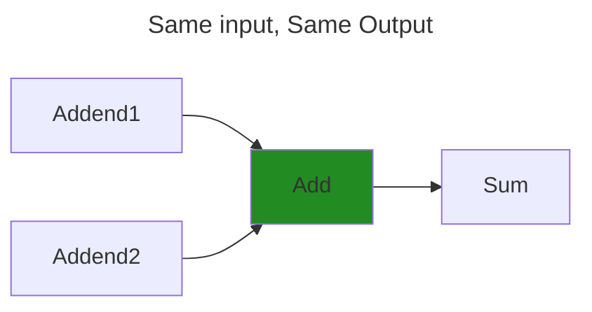

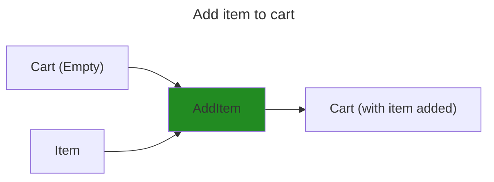


### What is Impure code

`Impure` = Non-deterministic

We still need to interact with the real `impure` world to get stuff done.

* Working with Databases and Gateways
* Sending emails
* Getting the current time

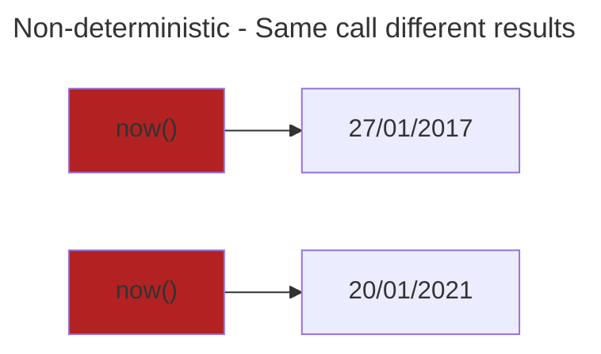

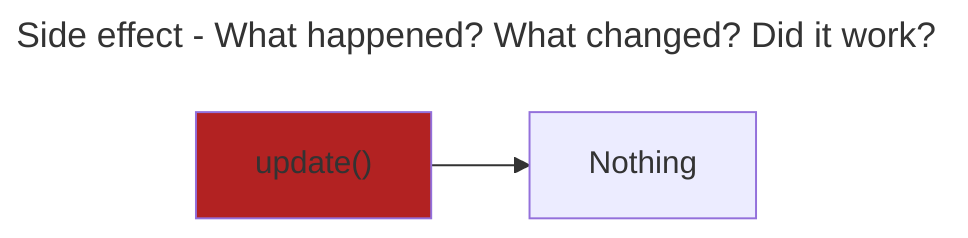

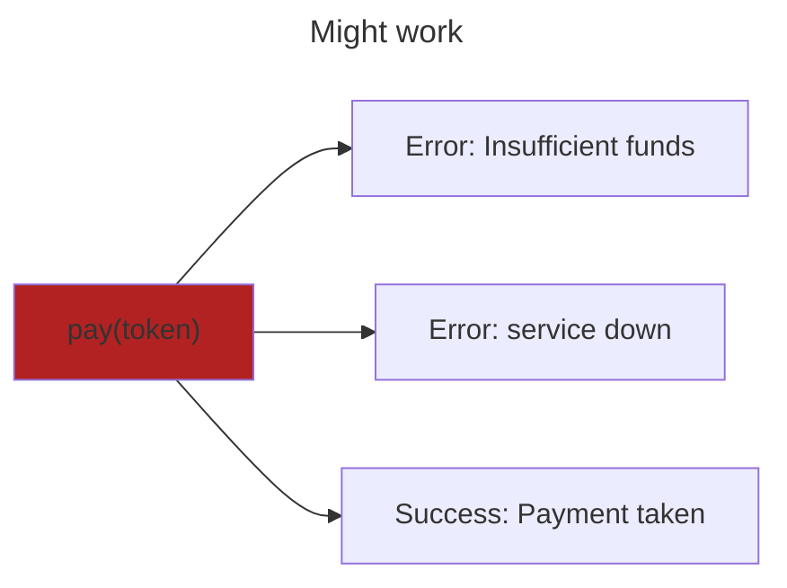

### Why the `Pure` and `Impure` language

`Impure` code calling `Pure` code remains `Pure`.
`Pure` code calling `Impure` code becomes `Impure`,
as the call is non-deterministic, making it non-deterministic.

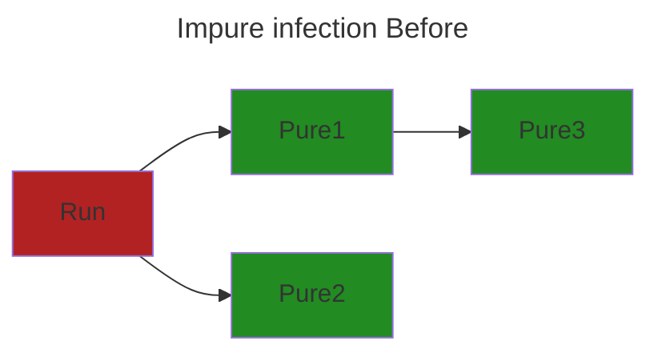

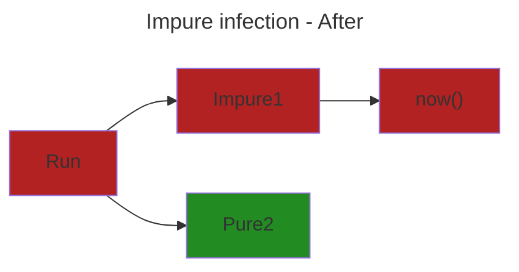

### (WIP) Prefer pure

Maximise the amount of `Pure` code and minimise the amount of `Impure` code

* Harder to read as `Impure` specific code is mixed with `Pure` domain workflows.
  * Connecting to database
  * Establishing a secure connection with a gateway
* Difficult to change if you later swap `I/O`.
  * Yesterday we use Payment service `A`
  * Today Payment service `A` want 50% of every sale
  * Tomorrow we need to swap out every instance of `A` with `B`
* Difficult to test as `I/O` is called directly.
  * Our Payment service charges $1 for every call
  * We don't want to pay $1 to run tests
* Error prone, Can fail and have to handle exceptions.
  * Payment service could be down


```diff
function application() {
-    var randomNumber = Random.generate(1, 100);
-    var now = DateTime.Now;
+    var randomDay = now.AddDays(randomNumber);

+    if (now.DayOfWeek == randomDay.DayOfWeek)
-       Console.WriteLine("Correct");
+    else {
+       var daysOut = Math.Abs((int)now.DayOfWeek - (int)randomDay.DayOfWeek);
-       Console.WriteLine($"Wrong, out by {daysOut} days");
    }
} 
```

Instead separate `pure` code out so it's all in the middle. (Like a Sandwich).

Query the `Database`, perform `Pure` domain logic, save to `Database`

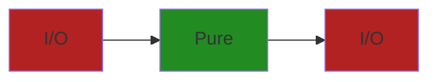

Splitting out the `Pure` code makes it

* Easier to read as no `Impure` code required. (Database, Date.Now, File system)
  * No setup code for Database or making network calls
* Easier to test (No Console, Date.Now, File system, Gateway)
  * Just pass data in, no need to Stub/Mock `Impure` code
* Reuse `Pure` code in different contexts.
  * Use in another application which uses CLI input.
  * Then use it in another application which uses HATEOAS instead.
* No unexpected results
  * Deterministic
  * Same input, Same output

```diff
function check(now, randomOffset) {
+    var randomDay = now.AddDays(randomNumber);

+    if (now.DayOfWeek == randomDay.DayOfWeek)
+       return "Correct";
+    else {
+       var daysOut = Math.Abs((int)now.DayOfWeek - (int)randomDay.DayOfWeek);
+       return $"Wrong, out by {daysOut} days";
    }
}

function application() {
-    var randomNumber = Random.generate(1, 100);
-    var now = DateTime.Now;

+    var result = pure(now, randomNumber);

-   Console.WriteLine(result)
} 
```

### Move details to edge (Port and Adapters, Persistence ignorance)

[TODO: Split into Port & Adapters, and Dependency injection]

* Adapter - Adapts `Impure` -> `Pure` and `Pure` -> `Impure`

Technical concerns may change in future and you don't want your `Domain logic`
to to depend on it.

* Don't want `HTTP` details contaminating your `Domain Logic`.
* Don't want `Domain Logic` knowing how to write to a `Database`

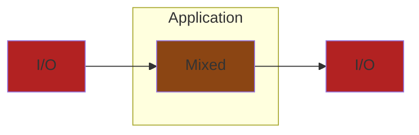

```c_sharp
public class Workflow {
  public void Handle(Guid customerId, List<Guid> productIds) {
    var database = new Database("connection-string");
    var customer = database.get(customerId); 

    var httpClient = new HttpClient();
    var raw_result = await httpClient.get("${productApi}?productIds=[productIds]");
    var products = raw_result.parse_products();
    
    var sum_products = products.reduce(product => product.price, 0);

    if (sum_products > customer.balance) {
      customer.balance -= sum_products;
      database.SaveChanges();
    } else {
      await EmailServer.Send(customer.Email, "Insufficient funds");
    }
  }
}
```

We have the problem of the interleaved `Pure` and `Impure` code.
But there's even more problems.

* It's hard to read what the function is even doing as there's so much code just
setting up our `Impure` code.
* What if the `products` API changes address or response data?
Now we need to update every instance of the api throughout our application
* How do we test this function?
Do we need to setup a Database and have access to payments API?
* It's non-deterministic?
  * What if the products API doesn't return all the products?
  * What if the price has changed?
  * What if the customer doesn't exist anymore?

This is where `Ports and Adapters` comes in.
We create `Adapters` that specifically handle `Impure` operations and pass
those into our `Pure` code (not pure now technically).

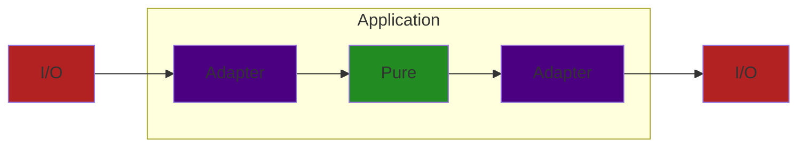

```c_sharp
public class Workflow(
  CustomerDatabase customerDatabase, 
  PaymentClient paymentClient
) {
  public Result<ProcessedOrder> Handle(Guid customerId, List<Guid> productIds) {
    var customer = await customreDatabase.get(customerId); 
    var products = await paymentClient.get(productIds);
    
    var result = UpdateBalance(customer, products);

    if (result != null) {
      await database.SaveChanges();
      return ProcessedOrder.Complete;
    } else {
      await EmailServer.Send(customer.Email, "Insufficient funds");
      return ProcessedOrder.Failed;
    }
  }

  private Customer? UpdateBalance(Customer customer, List<Product> products) {
    var sum_products = products.reduce(product => product.price, 0);

    if (sum_products > customer.balance) {
      customer.balance -= sum_products;
      return customer; 
    } else {
      return null;
    }
  }
}
```

Here the `CustomerDatabase` and `paymentClient` are both `Adapters`
abstracting how we deal with `Impure` code.
So it doesn't interfere with the main `Pure` domain workflow.

Fully fleshed out version below

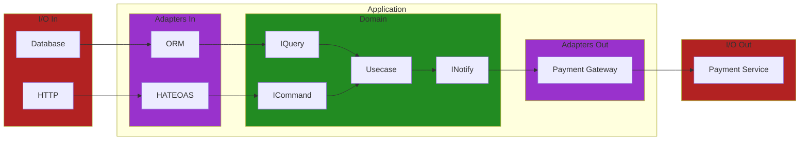

### Dependency Injection

### Testing

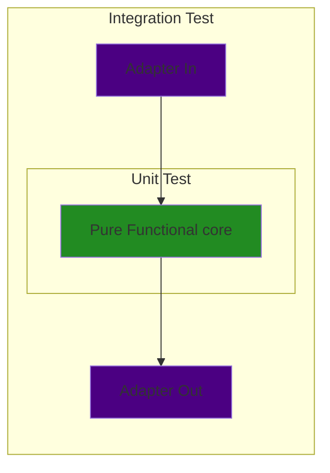

### Decouple Pure and Impure - Appeal to Authority

> The overriding rule that makes this architecture work is The Dependency Rule.
> This rule says that source code dependencies can only point inwards.
> Nothing in an inner circle can know anything at all about
> something in an outer circle.
> [...]
> We don’t want anything in an outer circle to impact the inner circles.
>
> [Uncle Bob - The Clean architecture](https://blog.cleancoder.com/uncle-bob/2012/08/13/the-clean-architecture.html)
> [!NOTE]
> Test at the boundaries of a system. Not the internals.
> Tests should be done at the `workflow` level.
> `Unit` produces no side effects and runs in isolation

* Benefits
  * Framework agnostic
    * Can change `Adapters` out without changing `Domain`.
  * Testable
    * Can test `Domain` without `I/O` (Database, HTTP, Service)

### Decouple Pure and Impure References

* [Moving IO to the edges of your app: Functional Core, Imperative Shell - Scott Wlaschin](https://www.youtube.com/watch?v=P1vES9AgfC4)
* [Functional core, Imperative shell - Gary Bernhardt](https://www.destroyallsoftware.com/screencasts/catalog/functional-core-imperative-shell)
* [Sandwich  architecture - Mark Seemann](https://blog.ploeh.dk/2023/10/09/whats-a-sandwich/)
* [Solving Problems the Clojure Way - Rafal Dittwald](https://www.youtube.com/watch?v=vK1DazRK_a0)
* [Clean Architecture - Uncle Bob](https://blog.cleancoder.com/uncle-bob/2012/08/13/the-clean-architecture.html)
* [Port and Adapters - Alistair Cockburn](https://alistair.cockburn.us/hexagonal-architecture/)

## Feature Cohesion

No

* Models/
* Controllers/
* Views/
* Services/

Yes

* Orders
  * Get/
    * handler.clj
    * spec.clj
  * Delete/
    * handler.clj
* Cart
  * cartAggregate.clj
  * AddItem/
    * handler.clj

### Feature Cohesion Examples

* Screaming Architecture
* Vertical Slice Architecture
* Modular Monolith

## Glossary

* Pure
  * Deterministic - Same input, Same output.
  * No side effects
* I/O (Input/Output)
  * Non-deterministic output, if any.
* Workflow / Use case / Story
  * Process that fulfils expected outcome
