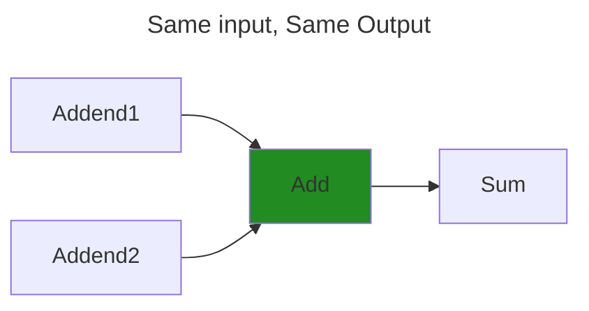
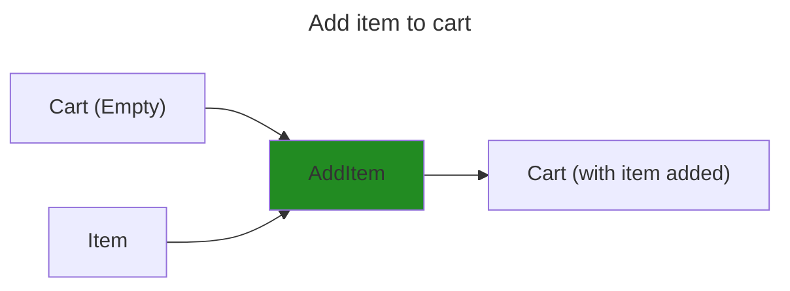
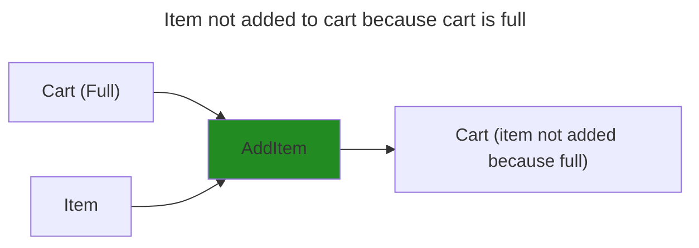
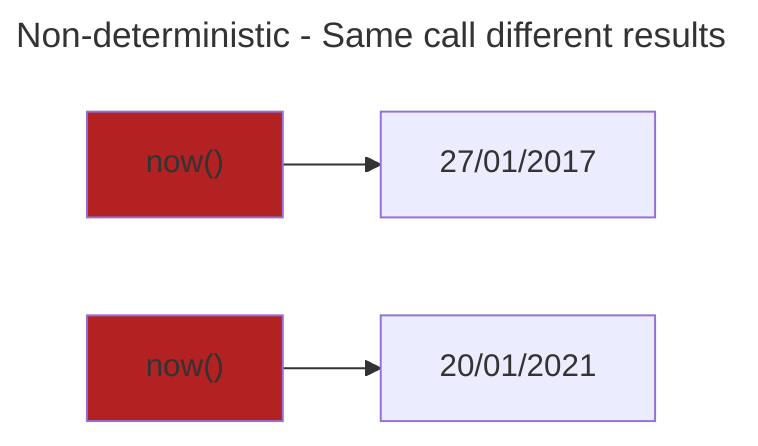
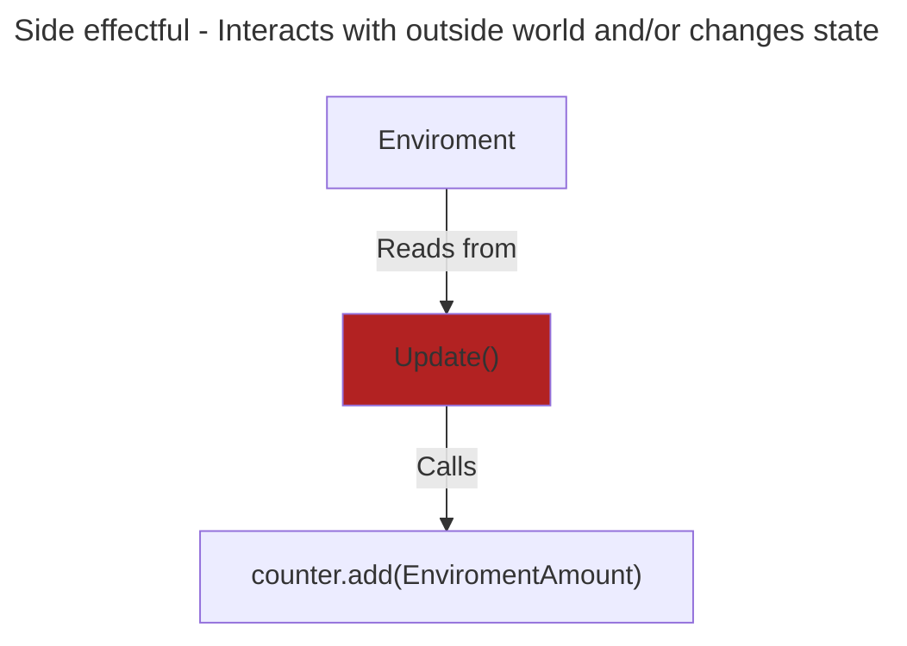
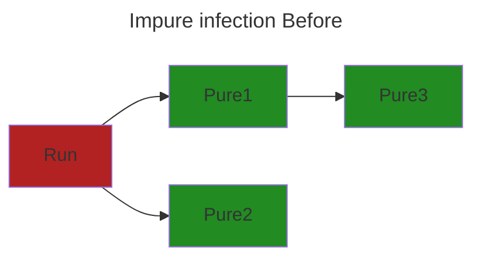
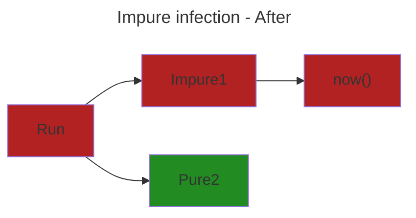
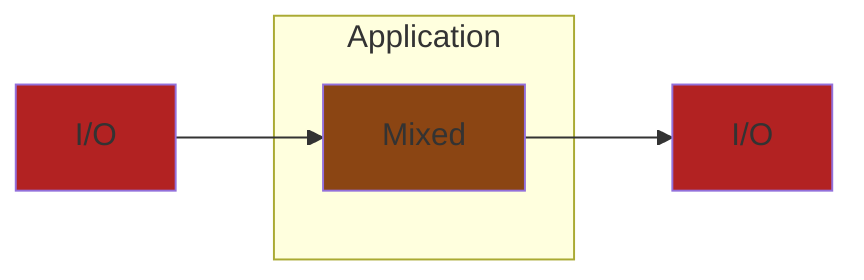
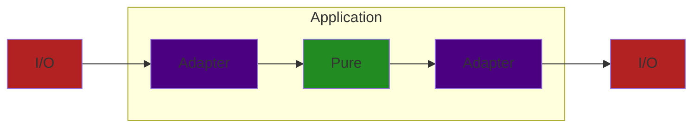
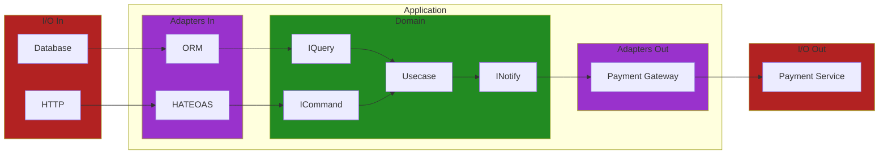

# (WIP) Structure
<!-- mtoc-start -->

* [Decouple Pure and Impure code](#decouple-pure-and-impure-code)
  * [What is Pure code](#what-is-pure-code)
  * [What is Impure code](#what-is-impure-code)
  * [Why the `Pure` and `Impure` language](#why-the-pure-and-impure-language)
  * [Prefer pure](#prefer-pure)
  * [(WIP) Prefer Pure architecture (Port and Adapters, Persistence ignorance)](#wip-prefer-pure-architecture-port-and-adapters-persistence-ignorance)
  * [(WIP) Decouple Pure and Impure - Appeal to Authority](#wip-decouple-pure-and-impure---appeal-to-authority)
  * [Decouple Pure and Impure References](#decouple-pure-and-impure-references)
* [(WIP) Feature Cohesion](#wip-feature-cohesion)
  * [Feature Cohesion Examples](#feature-cohesion-examples)
* [Glossary](#glossary)

<!-- mtoc-end -->

## Decouple Pure and Impure code

[TODO]: Why decoupling Pure and Impure code is important

### What is Pure code

`Pure` = Deterministic + No side effects

Given the same input you will always receive the same output,
regardless of how many times it's called or when it's called.

It also means it doesn't perform any `Side effects` ([more](#what-is-impure-code)).







### What is Impure code

`Impure` = Non-deterministic and/or performs `Side effect`



`Side effect` = Interacts with the outside world and/or changes state



We still need to interact with the real `impure` world to get stuff done.

* Working with Databases and Gateways
* Sending emails
* Getting the current time

A method that changes an objects state is another example of an `impure` operation

* Calling `user.GetName()` returns `Alice`
* `user.UpdateName(Bob)` changes the state of the `user` object
* Calling `user.GetName()` again now returns a different result `Bob`
* Making `user.GetName()` non-deterministic
* `user.UpdateName()` is `impure` as it changed the state of `user`

### Why the `Pure` and `Impure` language

`Impure` code calling `Pure` code remains `Pure`.
`Pure` code calling `Impure` code becomes `Impure`,
as the call is non-deterministic, making it non-deterministic.





### Prefer pure

With all that in mind, prefer `Pure` code over `Impure` code.
As it's easier to reason and test because it's deterministic.

I've created a silly simple code example that mixes the two.
It's game were you have to guess if the next card is higher or lower.
(Like Play Your Cards Right)

I've highlighted which parts are `Pure` and `Impure`

* Red - `Impure` code
* Green - `Pure` code

```diff
// Function to generate a random card value between 1 and 13
- function generateCard() {
-  return Math.floor(Math.random() * 13) + 1;
-}

// Function to start the game
function playGame() {
-  const currentCard = generateCard();
-  console.log(`Current card: ${currentCard}`);

  // User's guess
-  const userGuess = prompt("Will the next card be higher or lower or same? (h/l/s)");

-  const nextCard = generateCard();
-  console.log(`Next card: ${nextCard}`);

+  if ((userGuess === 'h' && nextCard > currentCard) || 
+      (userGuess === 'l' && nextCard < currentCard) ||
+      (userGuess === 's' && next == currentCard) {
-    console.log("You guessed it right!");
+  } else {
-    console.log("Sorry, you guessed it wrong.");
  }
}

// Call the playGame function to start the game
playGame();
```

So the above `playGame` holds a lot of complexity.

* Handling user input
  * `3` (`h|l|invalid`) permutations
* Generating random cards
  * `13` (`1,2,..,13`) permutations
* Comparing the cards
  * `169` (`13x13`) distinct pairs
* Comparing the user input with the comparison
  * `507` (`169 * 3`) guesses higher or lower

Making a total of `507` outcomes.
So we need to test some of the edge cases

| Guess | Card1 | Card2 | Expected |
| ------------- | -------------- | -------------- | ----- |
| Higher | 1 | 2 | Yes |
| Lower | 1 | 2 | No |
| Same | 1 | 2 | No |
| ... | ... | ... | ... |

However, adding tests for this code is difficult

* `Console` is required
* The code generates random cards

Instead by splitting out the `Pure` code makes it

* Easier to read
  * Can read `Pure` logic without any `Impure` context surrounding it
* Easier to automated test
  * No Console required (Avoids manual testing)
  * No stubbing the random card generator (Avoids setup complexity when testing logic)
  * Just input and expected output
* Reuse `compare` in different contexts
  * Currently uses `Console`
  * Could be used in a `RESTFUL` API instead
* No unexpected results
  * Deterministic
  * Same input, Same output

```diff
function compare(userGuess, currentCard, nextCard) {
+  if (userGuess === 'h' && nextCard > currentCard ||
+      userGuess === 'l' && nextCard < currentCard ||
+      userGuess === 's' && nextCart == currentCard)
+   return "Correct";
+  return "Sorry, you guessed wrong"
}

function playGame() {
-  const currentCard = generateCard();
-  console.log(`Current card: ${currentCard}`);

  // User's guess
-  const userGuess = prompt("Will the next card be higher or lower? (h/l)");
-  const nextCard = generateCard();
-  console.log(`Next card: ${nextCard}`);

+  const result = compare(userGuess, currentCard, nextCard);

-  console.log(result);
  }
}

// Tests
+ [2, 1, "l"]
+ [1, 2, "h"]
+ .. many more test cases here ...
+ test("Invalid guesses", (guess, current, next) => {
+  const actual = compare(guess, current, next)
+  expect(actual).is("Sorry, you guessed wrong")
+})
```

### (WIP) Prefer Pure architecture (Port and Adapters, Persistence ignorance)

* `Adapter` - Adapts `Impure` -> `Pure` and `Pure` -> `Impure`



```c_sharp
public class Workflow {
  public void Handle(HttpRequest request) {
    var customerId = request.body.GetCustomerId();
    var productIds = request.body.GetProductIds();
    var database = new SQLDatabase("connection-string");
    var customer = database.query(
      "SELECT * 
       FROM customer 
       WHERE id = ${customerId}"); 

    var httpClient = new HttpClient();
    var raw_result = await httpClient.get("${productApi}?productIds=[productIds]");
    var products = raw_result.parse_products();
    
    var sum_products = products.reduce(product => product.price, 0);

    if (sum_products > customer.balance) {
      customer.balance -= sum_products;
      database.SaveChanges();
    } else {
      await EmailServer.Send(customer.Email, "Insufficient funds");
    }
  }
}
```

We have the problem of the interleaved `Pure` and `Impure`
code like above ([Prefer pure](#prefer-pure)). But there's even more problems.

* It's hard to read what the function is doing
  * As there's so much code just setting up our `Impure` code.
* What if the `products` API changes address or response data?
  * Now we need to update every instance of the api throughout our application
* How do we test this function?
  * Do we need to setup a Database and have access to payments API?
  * Is it easy to create a `HTTP` request in `C#`?
* It's non-deterministic?
  * What if the products API doesn't return all the products?
  * What if the price has changed?
  * What if the customer doesn't exist anymore?
* We use a `HttpRequest` as input but what it want to use a different API in future?

This is where `Ports and Adapters` comes in.
We create `Adapters` that specifically handle `Impure` operations and
map them for `Pure` operations and vice versa.

`Technical` concerns may change but `Domain logic` should not be impacted.

* Difficult to change if you later swap `I/O`.
  * Yesterday we use Payment service `A`
  * Today Payment service `A` want 50% of every sale
  * Now we need to swap out every instance of `A` with `B`
* Difficult to test as `I/O` is called directly.
  * Our Payment service charges $1 for every call
  * We don't want to pay $1 to run tests
* Don't want `HTTP` details contaminating `Domain Logic`.
* Don't want `Domain Logic` knowing how to write to a `Database`



```c_sharp
public class Workflow(
  CustomerDatabase customerDatabase, 
  PaymentClient paymentClient
) {
  public Result<ProcessedOrder> Handle(Guid customerId, List<Guid> productIds) {
    var customer = await customreDatabase.get(customerId); 
    var products = await paymentClient.get(productIds);
    
    var result = UpdateBalance(customer, products);

    if (result != null) {
      await database.SaveChanges();
      return ProcessedOrder.Complete;
    } else {
      await EmailServer.Send(customer.Email, "Insufficient funds");
      return ProcessedOrder.Failed;
    }
  }

  private Customer? UpdateBalance(Customer customer, List<Product> products) {
    var sum_products = products.reduce(product => product.price, 0);

    if (sum_products > customer.balance) {
      customer.balance -= sum_products;
      return customer; 
    } else {
      return null;
    }
  }
}
```

Here the `CustomerDatabase` and `paymentClient` are both `Adapters`
abstracting how we deal with `Impure` code.
So it doesn't interfere with the main `Pure` domain workflow.

Fully fleshed out version below



### (WIP) Decouple Pure and Impure - Appeal to Authority

> The overriding rule that makes this architecture work is The Dependency Rule.
> This rule says that source code dependencies can only point inwards.
> Nothing in an inner circle can know anything at all about
> something in an outer circle.
> [...]
> We don’t want anything in an outer circle to impact the inner circles.
>
> [Uncle Bob - The Clean architecture](https://blog.cleancoder.com/uncle-bob/2012/08/13/the-clean-architecture.html)
> [!NOTE]
> Test at the boundaries of a system. Not the internals.
> Tests should be done at the `workflow` level.
> `Unit` produces no side effects and runs in isolation

* Benefits
  * Framework agnostic
    * Can change `Adapters` out without changing `Domain`.
  * Testable
    * Can test `Domain` without `I/O` (Database, HTTP, Service)

### Decouple Pure and Impure References

* [Moving IO to the edges of your app: Functional Core, Imperative Shell - Scott Wlaschin](https://www.youtube.com/watch?v=P1vES9AgfC4)
* [Functional core, Imperative shell - Gary Bernhardt](https://www.destroyallsoftware.com/screencasts/catalog/functional-core-imperative-shell)
* [Sandwich  architecture - Mark Seemann](https://blog.ploeh.dk/2023/10/09/whats-a-sandwich/)
* [Solving Problems the Clojure Way - Rafal Dittwald](https://www.youtube.com/watch?v=vK1DazRK_a0)
* [Clean Architecture - Uncle Bob](https://blog.cleancoder.com/uncle-bob/2012/08/13/the-clean-architecture.html)
* [Port and Adapters - Alistair Cockburn](https://alistair.cockburn.us/hexagonal-architecture/)

## (WIP) Feature Cohesion

No

* Models/
* Controllers/
* Views/
* Services/

Yes

* Orders
  * Get/
    * handler.clj
    * spec.clj
  * Delete/
    * handler.clj
* Cart
  * cartAggregate.clj
  * AddItem/
    * handler.clj

### Feature Cohesion Examples

* Screaming Architecture
* Vertical Slice Architecture
* Modular Monolith

## Glossary

* Pure
  * Deterministic - Same input, Same output.
  * No side effects
* I/O (Input/Output)
  * Non-deterministic output, if any.
* Workflow / Use case / Story
  * Process that fulfils expected outcome
