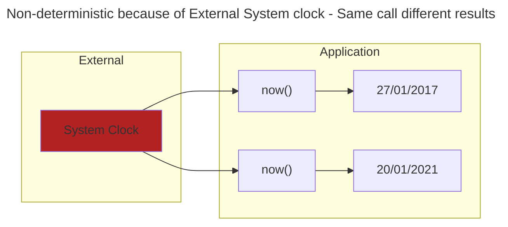
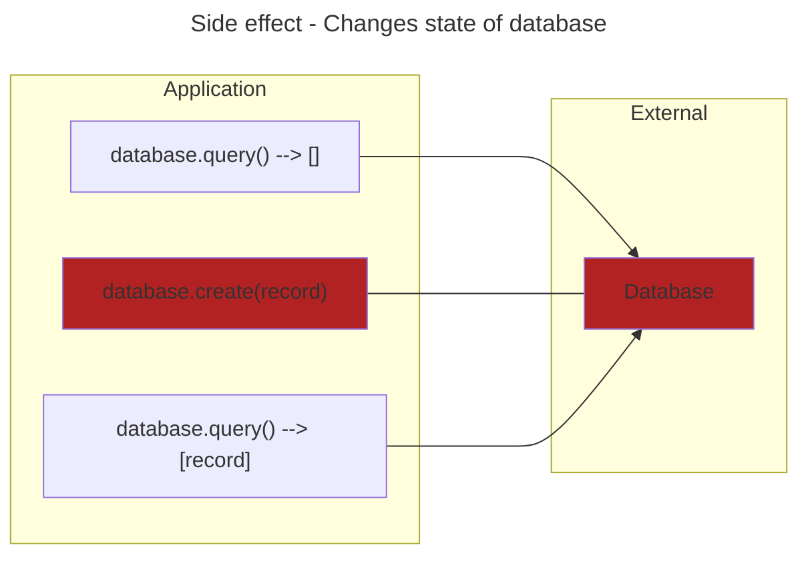
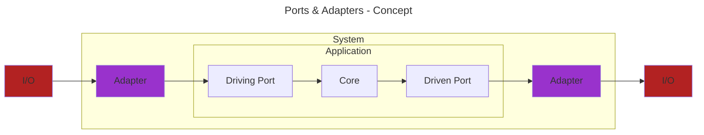
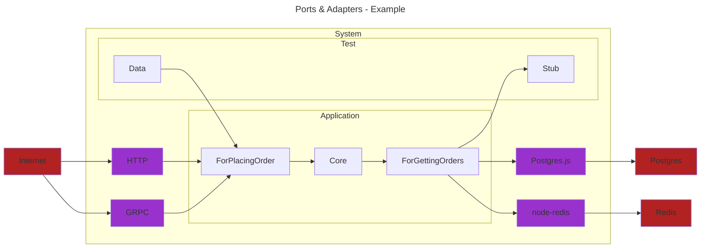
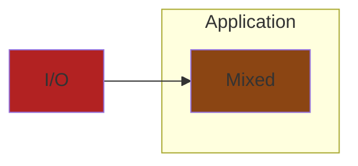

# (WIP) Structure
<!-- mtoc-start -->

* [Decouple Pure and Impure code](#decouple-pure-and-impure-code)
  * [What is Pure code](#what-is-pure-code)
  * [What is Impure code](#what-is-impure-code)
  * [Why the `Pure` and `Impure` language](#why-the-pure-and-impure-language)
  * [Prefer pure](#prefer-pure)
  * [Decouple Pure and Impure References](#decouple-pure-and-impure-references)
* [Decouple Domain from External details](#decouple-domain-from-external-details)
  * [Appeal to Authority for Decoupling Domain from External](#appeal-to-authority-for-decoupling-domain-from-external)
  * [Ports and Adapters](#ports-and-adapters)
  * [Decoupling External Driving Details from Domain](#decoupling-external-driving-details-from-domain)
  * [Decoupling Domain from Driven External Details](#decoupling-domain-from-driven-external-details)
  * [Decouple Domain and External references](#decouple-domain-and-external-references)
* [(WIP) Feature Cohesion](#wip-feature-cohesion)
  * [Feature Cohesion Examples](#feature-cohesion-examples)

<!-- mtoc-end -->

## Decouple Pure and Impure code

[TODO]: Why decoupling Pure and Impure code is important

### What is Pure code

`Pure` = Deterministic + No side effects

Given the same inputs returns the same output.
Regardless of how many times it's called or when it's called.

It also means it doesn't perform any `Side effects` ([more](#what-is-impure-code)).


### What is Impure code

`Impure` = Non-deterministic because of external dependencies
and/or performs `Side effect`





`Object`'s are another example of `Impurity`.
As an `Object`'s method changes the state. (`Side effect`)

* Calling `user.GetName()` returns `Alice`
* `user.UpdateName(Bob)` changes the state of the `user` object
* Calling `user.GetName()` again now returns a different result `Bob`

`user.GetName()` is `non-deterministic` as the result changed
and `user.UpdateName()` is a `Side-effect` as it changed the `state` of
the `user` object.

However, We still need to interact with `Impure` sources to get stuff done.

* Storing records to a Database
* Querying a Database
* Sending emails
* Getting the current time

### Why the `Pure` and `Impure` language

`Impure` code calling `Pure` code remains `Pure`.
`Pure` code calling `Impure` code becomes `Impure`,
as the call is non-deterministic, making it non-deterministic.


### Prefer pure

With all that in mind, prefer `Pure` code over `Impure` code.
As it's easier to reason and test because it's deterministic.

I've created a simple code example that mixes the two.
It's game were you have to guess if the next card is higher or lower.
(Like Play Your Cards Right)

I've highlighted which parts are `Pure` and `Impure`

* Red - `Impure` code
* Green - `Pure` code

```diff
// Function to generate a random card value between 1 and 13
- function generateCard() {
-  return Math.floor(Math.random() * 13) + 1;
-}

// Function to start the game
function playGame() {
-  const currentCard = generateCard();
-  console.log(`Current card: ${currentCard}`);

  // User's guess
-  const userGuess = prompt("Will the next card be higher or lower or same? (h/l/s)");

-  const nextCard = generateCard();
-  console.log(`Next card: ${nextCard}`);

+  if ((userGuess === 'h' && nextCard > currentCard) || 
+      (userGuess === 'l' && nextCard < currentCard) ||
+      (userGuess === 's' && next == currentCard) {
-    console.log("You guessed it right!");
+  } else {
-    console.log("Sorry, you guessed it wrong.");
  }
}

// Call the playGame function to start the game
playGame();
```

So the above `playGame` holds a lot of complexity.

* Handling user input
  * `3` (`h|l|s`) permutations
* Generating random cards
  * `13` (`1,2,..,13`) permutations
* Comparing the cards
  * `169` (`13x13`) distinct pairs
* Comparing the user input with the comparison
  * `507` (`169 * 3`) pairs and guesses

`507` possible outcomes (that's even ignoring errors).
Ideally we should test the edge cases to make sure it works.

| Guess | Current Card | Next Card | Correct? |
| ------------- | -------------- | -------------- | ----- |
| Higher | 1 | 2 | Yes |
| Lower | 1 | 2 | No |
| Same | 1 | 2 | No |
| ... | ... | ... | ... |

However, adding tests for this code is difficult

* `Console` is required for input and output
* Code generates random cards making it non-deterministic

Instead split the `Pure` from the `Impure`

* Easier to read
  * Can read `compare` (Pure) logic without any `Impure` context
* Easier to test
  * No Console required (Avoids manual testing)
  * No stubbing of random card generator
  * Just input and expected output. (Parameterized tests)
* Reuse `compare` in different contexts
  * Currently uses `Console`
  * Could be used in a `RESTFUL` API instead

```diff
function compare(userGuess, currentCard, nextCard) {
+  if (userGuess === 'h' && nextCard > currentCard ||
+      userGuess === 'l' && nextCard < currentCard ||
+      userGuess === 's' && nextCart == currentCard)
+   return "Correct";
+  return "Sorry, you guessed wrong"
}

function playGame() {
-  const currentCard = generateCard();
-  console.log(`Current card: ${currentCard}`);

  // User's guess
-  const userGuess = prompt("Will the next card be higher or lower? (h/l)");
-  const nextCard = generateCard();
-  console.log(`Next card: ${nextCard}`);

+  const result = compare(userGuess, currentCard, nextCard);

-  console.log(result);
  }
}

// Tests
+ [2, 1, "h"]
+ [1, 2, "l"]
+ [1, 2, "s"]
+ .. many more test cases here ...
+ test("Invalid guesses", (guess, current, next) => {
+  const actual = compare(guess, current, next)
+  expect(actual).is("Sorry, you guessed wrong")
+})
```

### Decouple Pure and Impure References

* [Moving IO to the edges of your app: Functional Core, Imperative Shell - Scott Wlaschin](https://www.youtube.com/watch?v=P1vES9AgfC4)
* [Functional core, Imperative shell - Gary Bernhardt](https://www.destroyallsoftware.com/screencasts/catalog/functional-core-imperative-shell)
* [Sandwich  architecture - Mark Seemann](https://blog.ploeh.dk/2023/10/09/whats-a-sandwich/)
* [Solving Problems the Clojure Way - Rafal Dittwald](https://www.youtube.com/watch?v=vK1DazRK_a0)

## Decouple Domain from External details

Changes to external processes shouldn't impact internal processes.

Changes to internal processes shouldn't impact external processes.

`Internals/Application` = The Domain (DDD) The business rules.
(`Application` in Ports & Adapters or `Appliction + Core` in Clean Architecture)

`External` =
> An external system is basically one whose interface your team can't change.
Any off-the-shelf purchased products, third party libraries, databases,
and subsystems defined by other teams, are external systems.

[Alistair Cockburn - Hexagonal Architecture Explained](https://store7710079.company.site/Hexagonal-Architecture-Explained-p655931616)

| Protocol | Media | Structure |
| --- | --- | --- |
|  HTTP | JSON | Database Schema |
|  GRPC | ProtoBuf |  API model |
|  SOAP | XML | Library model |
|  Websocket | | |
| GraphQL | | |

Benefits of decoupling `Domain` from `External Systems`

* Design
  * Focus on `Domain` design without technology detail distractions
  * Not constrained by `External` systems designs
    * JSON doesn't support `Value Objects` (Date Time, Money, Any Domain models)
    * Create your own preferred interface to working with `External` systems.
    `External` system returns data one way but you don't want it dictating
    your `Domain` model
  * Change `External` system without changing `Domain`
    * Easily change from one provider to another by creating a new `Adapter`
  * Change `Domain` model without breaking contract with `External` consumers
    * Returning our `Domain` model directly whilst many `consumers` depend on
    that model (contract). Prevents improving the `Domain` model
* Testing
  * Test `Domain` end-to-end without `External` systems (Database, HTTP, API)
  * Not constrained by `External` systems availability
    * What if `dev` server is down? You can't run your `Application` locally as
    it's dependent on the `External` system. You can't pass in `Stubbed` data
    instead for running locally.

### Appeal to Authority for Decoupling Domain from External

> Don't allow Externals (you don't control) to couple to the internals (you do control)

[CodeOpinion - DTOs & Mapping](https://www.youtube.com/watch?v=FKFxWrwdAWc)

* > The whole point of the Ports & Adapters architecture is that the
application is oblivious to the external connections.

* > The pattern says, "Put an API around everywhere and separate the inside
from the outside"

* > Ports & Adapters ... Says the `app` can have no knowledge of what its
`external` connections are made of. [...] All the compile-time dependencies
point inward to the `app`, with none coming from the `app` to the `external` `actors`

* > Ports & Adapters [...] puts all `external` technologies outside the app,
so that the inside only contains domain concepts. From there, you can do
domain-driven design without distraction.

[Alistair Cockburn - Hexagonal Architecture Explained](https://store7710079.company.site/Hexagonal-Architecture-Explained-p655931616)
> The overriding rule that makes this architecture work is The Dependency Rule.
> This rule says that source code dependencies can only point inwards.
> Nothing in an inner circle can know anything at all about
> something in an outer circle.
> [...]
> We don’t want anything in an outer circle to impact the inner circles.

[Uncle Bob - The Clean architecture](https://blog.cleancoder.com/uncle-bob/2012/08/13/the-clean-architecture.html)

### Ports and Adapters

`Ports & Adapters` =
> Create you `Application` to work without either a UI or a database so you
can run automated regression-tests against it, change connected technologies,
protect it from leaks between business logic and technologies, work when the
database becomes unavailable, and link applications together without any user involvement.

[Alistair Cockburn - Hexagonal Architecture Explained](https://store7710079.company.site/Hexagonal-Architecture-Explained-p655931616)

`Port` =
> Every interaction between the `app` and the `outside` world happens at a
`port` interface, using the interface language the `app` itself defines.
As such, the ports are the demarcation of what is `inside` the app proper,
and what is `outside`

[Alistair Cockburn - Hexagonal Architecture Explained](https://store7710079.company.site/Hexagonal-Architecture-Explained-p655931616)
The `app` has no knowledge of the technology used outside of the port.

`Adapter` = Adapts `External` <-> `Domain`

* Adapts `Postres`/`Mongo` query results to `Domain` models
* Adapts `Domain` models to `Third party` API models

`Glossary`

* Application (App) - Business logic. No reference to any technologies
* Port - Interface into Application. Port captures the Idea of a conversation
  * Driving Ports (Calls to Application)
    * For Instantiating the configuring the system
    * For performing administrative work on the system
    * For using the system to get business work done
  * Driven Ports (Calls by Application)
    * For Getting information from repository
    * For Notifying someone
    * For controlling some device
* Actors - External entities that interact with the system. (Behaviour)
  * Driving Actor - Calls Application. (UI, Human, System)
    * `ForWebUI(application)`
    * `ForCli(application)`
  * Driven Actor - Application calls (System, Database, Gateway)
    * `Application(ForGettingData, ForCallingThirdPart, ForGettingDateTime)`
* Adapters - Converts `Actor` to Driving `Port`, Coverts `Appliction` to Driven `Port`
* Configurator - Composes everything together





### Decoupling External Driving Details from Domain



I've created an example to demonstrate Driving `Adapters`.
Using the same game as before but this time for `HTTP`.

I've highlighted which parts are `Domain` and `External`

* Red - `External`
* Green - `Domain`

```diff
function compare(HttpRequest request, nextCard) {
-  const currentCard = request.body.currentCard;
-  const userGuess = request.body.userGuess;

+  if (userGuess === 'h' && nextCard > currentCard ||
+      userGuess === 'l' && nextCard < currentCard ||
+      userGuess === 's' && nextCart == currentCard)
+   return "Correct";
+  return "Sorry, you guessed wrong"
}

function PlayGameHttp(HttpRequest request) {
   const nextCard = generateCard();

+  const result = compare(request, nextCard);

-  return HttpResponse(result);
}
```

This has problems with `Coupling` specific details for `HTTP` with our `Domain` logic

* What if we stop using `HTTP`
* What if we want to use `GRPC`
* We don't want `HTTP` details contaminating our `Domain` model
* Have to create a `HTTP` request to test `Domain` logic

This is where `Ports and Adapters` comes in.
We create `Adapters` that convert specific `External`
implementation details to our `Domain` concepts.

```diff
function HttpBodyToGameDomainModel(HttpBody body) {
- // Specifics about extracting data from HTTP body 
- // and converting to our Domain model
}

function compare(userGuess, currentCard, nextCard) {
+  if (userGuess === 'h' && nextCard > currentCard ||
+      userGuess === 'l' && nextCard < currentCard ||
+      userGuess === 's' && nextCart == currentCard)
+   return "Correct";
+  return "Sorry, you guessed wrong"
}

function main(){
  route("/play", (request) => {
-   const { currentCard, userGuses } = HttpBodyToGameDomainModel(request.body);
+   const result = compare(userGuess, currentCard, nextCard);
-   return Ok(result);
  })
}
```

Now `compare` doesn't know anything about `HttpRequest` it just takes
data. It can now be used in different contexts like a `GRPC` application.
It also makes it easier to test as we don't have to create a `HttpRequest`
for our tests.

### Decoupling Domain from Driven External Details

If you return your Domain model

* Changing Domain breaks contract with clients
* Limit your domain model as you have to conform to contract

### Decouple Domain and External references

* [Sandwich  architecture - Mark Seemann](https://blog.ploeh.dk/2023/10/09/whats-a-sandwich/)
* [Clean Architecture - Uncle Bob](https://blog.cleancoder.com/uncle-bob/2012/08/13/the-clean-architecture.html)
* [Port and Adapters - Alistair Cockburn](https://alistair.cockburn.us/hexagonal-architecture/)

## (WIP) Feature Cohesion

No

* Models/
* Controllers/
* Views/
* Services/

Yes

* Orders
  * Get/
    * handler.clj
    * spec.clj
  * Delete/
    * handler.clj
* Cart
  * cartAggregate.clj
  * AddItem/
    * handler.clj

Ports and Adapters suggestion

* App/
  * BusinessLogic/
  * DrivingPorts/
    * for_doing_something.file
    * for_calculating_taxes.file
  * DrivenPorts/
* Test/
* Driving/
* Driven/

### Feature Cohesion Examples

* Screaming Architecture
* Vertical Slice Architecture
* Modular Monolith
